# 基于多智能体与知识图谱的智能医疗辅助诊断系统 — 毕业论文框架

> 本文档为论文各章节的写作思路指导，标注了需要配图和需要查找文献的位置。
> - 📊 = 需要提供参考图/截图/示意图
> - 📚 = 需要查找文献引用
> - 💡 = 写作思路提示

---

## 目    录

```
第一章  前  言 .................................................. 1
  1.1 研究背景 ................................................. 1
  1.2 研究意义 ................................................. 2
  1.3 国内外研究现状 ........................................... 3
    1.3.1 知识图谱在医疗领域的研究现状 ......................... 3
    1.3.2 多智能体系统研究现状 ................................. 4
    1.3.3 检索增强生成（RAG）研究现状 .......................... 5
    1.3.4 现有研究不足与本文切入点 ............................. 5
  1.4 研究内容 ................................................. 6
  1.5 论文结构安排 ............................................. 7

第二章  相关技术与理论基础 ....................................... 8
  2.1 开发环境与工具 ........................................... 8
  2.2 大语言模型与提示工程 ...................................... 9
  2.3 多智能体系统与LangGraph框架 ............................... 11
  2.4 知识图谱与Neo4j图数据库 .................................. 13
  2.5 检索增强生成（RAG） ...................................... 14
  2.6 模型上下文协议（MCP） .................................... 15
  2.7 本章小结 ................................................. 16

第三章  系统需求分析与总体设计 .................................. 18
  3.1 系统需求分析 ............................................ 18
    3.1.1 功能需求分析 ....................................... 18
    3.1.2 非功能需求分析 ..................................... 19
  3.2 系统总体架构设计 ........................................ 20
  3.3 功能模块设计 ............................................ 21
    3.3.1 知识图谱构建模块 ................................... 21
    3.3.2 多智能体工作流模块 ................................. 23
    3.3.3 MCP工具服务模块 .................................... 25
    3.3.4 服务端知识管理模块 ................................. 26
    3.3.5 分诊评估模块 ....................................... 27
    3.3.6 风险评估模块 ....................................... 28
    3.3.7 多专家会诊模块 ..................................... 29
    3.3.8 知识查询模块 ....................................... 30
    3.3.9 患者数据管理模块 ................................... 31
  3.4 数据库设计 .............................................. 30
    3.4.1 Neo4j知识图谱数据模型 .............................. 30
    3.4.2 Redis向量索引设计 .................................. 32
    3.4.3 文件系统存储设计 ................................... 32
  3.5 接口设计 ................................................ 33
    3.5.1 REST API接口设计 ................................... 33
    3.5.2 MCP工具接口设计 .................................... 34
    3.5.3 SSE实时通信接口 ..................................... 34
  3.6 本章小结 ................................................ 35

第四章  系统详细设计与实现 ...................................... 36
  4.1 知识图谱自动化构建实现 .................................. 36
    4.1.1 PDF文献解析（Docling）.............................. 36
    4.1.2 文本清洗与分块 ..................................... 38
    4.1.3 基于LLM的实体关系抽取 .............................. 39
    4.1.4 Neo4j图谱存储 ..................................... 41
    4.1.5 症状向量化索引 ..................................... 42
  4.2 多智能体工作流实现 ...................................... 43
    4.2.1 LangGraph状态图构建 ................................ 43
    4.2.2 监督节点——任务路由 ................................ 45
    4.2.3 分诊节点——并行分诊 ................................ 46
    4.2.4 风险评估节点——Softmax概率计算 ...................... 48
    4.2.5 多专家会诊节点 ..................................... 50
    4.2.6 知识查询节点 ....................................... 52
  4.3 MCP工具服务实现 ......................................... 53
    4.3.1 症状检索分析工具 ................................... 53
    4.3.2 疾病诊断方法查询工具 ............................... 54
    4.3.3 向量检索医学知识工具 ............................... 55
  4.4 服务端知识管理实现 ...................................... 56
    4.4.1 知识管理REST API ................................... 56
    4.4.2 异步处理与SSE进度推送 .............................. 57
    4.4.3 数据一致性管理 ..................................... 58
  4.5 前端界面实现 ............................................ 59
    4.5.1 客户端——诊断界面 .................................. 59
    4.5.2 服务端——知识管理界面 ............................... 60
  4.6 系统部署实现 ............................................ 61
    4.6.1 LLM模型部署（AutoDL + Ollama） ..................... 61
    4.6.2 Docker容器化与混合部署 ............................. 62
  4.7 本章小结 ................................................ 62

第五章  系统测试 ............................................... 61
  5.1 测试环境 ................................................ 61
  5.2 功能测试 ................................................ 61
    5.2.1 知识图谱构建测试 ................................... 62
    5.2.2 智能分诊测试 ....................................... 63
    5.2.3 风险评估测试 ....................................... 64
    5.2.4 多专家会诊测试 ..................................... 64
    5.2.5 知识查询测试 ....................................... 65
  5.3 性能测试 ................................................ 65
  5.4 测试结论 ................................................ 66

第六章  总结与展望 ............................................. 67
  6.1 总结 .................................................... 67
  6.2 不足与展望 .............................................. 68

参考文献 ....................................................... 69
致谢 ........................................................... 71
```

---

## 各章节写作思路详细指导

---

### 第一章 前言

#### 1.1 研究背景

💡 **写作思路：**
- 从宏观政策切入：2025年国家卫健委《关于促进和规范"人工智能+医疗卫生"应用发展的实施意见》，政策明确提出基层诊疗智能辅助、临床专病专科智能体应用等方向
- 描述急诊医疗场景的实际痛点：患者多/病情复杂/时间紧迫、知识更新快/获取困难、跨学科会诊资源有限
- 引出AI技术（LLM、知识图谱、多智能体）为解决这些问题提供了新的可能
- 2-3段即可，控制在1页左右

📚 **需要查找的文献：**
- 国家卫健委《关于促进和规范"人工智能+医疗卫生"应用发展的实施意见》（政策文件，你的项目文档中已有）
- 全球医疗AI市场规模数据（如：Grand View Research或IDC的市场报告）
- 急诊分诊相关的临床痛点文献（中文期刊，如《中华急诊医学杂志》）

---

#### 1.2 研究意义

💡 **写作思路：**
- **理论意义**：探索多智能体系统在医疗领域的应用模式；验证知识图谱+RAG融合方案的可行性；丰富MCP协议在多智能体知识调度中的实践
- **实践意义**：为急诊医生提供智能分诊和辅助诊断工具；降低基层医疗机构对专家资源的依赖；支持医学知识的自动化积累和结构化管理
- 分理论和实践两个角度展开，各2-3段

📚 **需要查找的文献：**
- 多智能体在医疗领域应用的综述类文献
- 知识图谱辅助临床决策支持的效果评估文献

---

#### 1.3 国内外研究现状

💡 **写作思路：**

**1.3.1 知识图谱在医疗领域的研究现状**
- 国际：提及UMLS、SNOMED CT等医学本体，以及近年来基于深度学习的医学知识图谱自动化构建工作
- 国内：中文电子病历实体抽取（浙大团队）、医学知识图谱构建流水线（Docling+Neo4j）
- 总结不足：多为离线工具链，难以与前端诊疗智能体形成实时闭环

**1.3.2 多智能体系统研究现状**
- HuatuoGPT、"扁鹊"等国内医疗大模型在问诊领域的探索
- 国外：Med-PaLM、GPT-4在USMLE等医学评测中的表现
- 总结不足：多为单一智能体，缺乏多角色协作的动态知识调度

**1.3.3 检索增强生成（RAG）研究现状**
- RAG技术从文本检索到向量检索的演进
- 融合知识图谱的RAG方案在抑制LLM"幻觉"方面的效果（北京大学团队）
- 总结不足：多集中于单一检索策略，缺乏结构化知识+向量检索的混合方案

**1.3.4 现有研究不足与本文切入点**
- 综合总结前三节的gap
- 明确本文的定位：在Neo4j+Redis知识底座上，通过MCP统一暴露工具，在LangGraph中实现多节点智能体协作

📚 **需要查找的文献（此节是文献最密集的部分，建议10-15篇）：**
- 开题报告中已有10篇文献，可直接复用
- 补充：LangChain/LangGraph相关技术论文或官方文档
- 补充：Neo4j在医疗领域应用的案例研究
- 补充：向量检索（如FAISS、Redis向量索引）相关论文
- 补充：MCP协议的官方规范文档（Anthropic发布）

---

#### 1.4 研究内容

💡 **写作思路：**
- 逐条列出本文的主要研究工作（4-5条），每条1-2句话：
  1. 设计并实现了七步知识图谱自动化构建流水线
  2. 基于LangGraph实现了五节点多智能体协作架构
  3. 通过MCP协议实现了知识服务的标准化工具调用
  4. 实现了结构化知识图谱+向量检索的混合RAG系统
  5. 构建了包含诊断端和知识管理端的双前端系统

---

#### 1.5 论文结构安排

💡 **写作思路：**
- 简要描述每一章的内容，1-2句话/章
- "第一章介绍了...，第二章阐述了...，第三章分析了...，第四章详细实现了...，第五章进行了...，第六章总结了..."

---

### 第二章 相关技术与理论基础

> ⚠️ 本科论文第二章要求：每个技术点介绍"是什么→有什么特点→本系统为什么用它"即可，不需要深入推导公式或对比大量方案。每节控制在1-2页，整章约8-10页。

#### 2.1 开发环境与工具

💡 **写作思路（约1页）：**
- Python语言简介：一两句话概括特点，重点说明AI生态成熟是选择Python的主要原因
- 开发工具一句话带过（如PyCharm + Git）
- 用一个**表格**列出核心依赖库及版本，分为几类：
  - 智能体框架：LangChain 0.3.27、LangGraph 0.6.8
  - 向量化模型：sentence-transformers 2.2.0+
  - 知识图谱：neo4j 5.14.0+、py2neo
  - 文献处理：docling 2.0.0
  - MCP协议：fastmcp 0.1.0
  - Web服务：FastAPI 0.117.1

📊 **需要提供的图：**
- 【表格】核心依赖库版本清单表

---

#### 2.2 大语言模型与提示工程

💡 **写作思路（约2页）：**

第一部分：什么是大语言模型
- 用通俗的语言解释：大语言模型（LLM）是基于深度学习的自然语言处理模型，通过海量文本数据训练，具备理解和生成自然语言的能力
- 简要提及Transformer是LLM的基础架构（不需要推导注意力公式，画一张架构示意图即可）
- LLM的发展脉络用一句话概括：从BERT到GPT系列，再到国产开源模型Qwen
- 本系统使用Qwen2.5-14B：阿里通义千问开源模型，支持中英双语
- 部署方式：在AutoDL云GPU服务器上通过Ollama部署模型，使用cpolar内网穿透暴露为公网API（OpenAI兼容接口），客户端通过固定域名调用

第二部分：什么是提示工程
- 提示工程就是通过设计输入文本（提示词）来引导LLM输出期望的结果
- 介绍本系统用到的几种提示技术（不需要面面俱到，挑重点）：
  - **系统提示词**：给每个智能体设定不同的医学角色（如"你是一名急诊分诊护士"）
  - **结构化输出**：要求LLM返回JSON格式的结果（如实体抽取）
- 举一个本系统中的实际Prompt示例（从代码中截取1个即可，让读者直观感受）

📚 **需要查找的文献（2-3篇）：**
- Vaswani A et al. "Attention Is All You Need." NeurIPS, 2017.（提一下即可，不用深入讲）
- 一篇中文的LLM综述或大模型应用综述
- HuatuoGPT论文（开题报告中已有，体现医疗LLM应用）

📊 **需要提供的图：**
- 【图】Transformer架构示意图（网上找标准图即可，标注来源）
- 【图】提示工程在本系统中的应用示意（输入Prompt → LLM → 结构化输出，简单流程图）

---

#### 2.3 多智能体系统与LangGraph框架

💡 **写作思路（约2页）：**

第一部分：什么是智能体和多智能体系统
- 智能体（Agent）：能感知环境、做出决策并执行行动的自主程序。基于LLM的智能体以大模型为核心，通过调用工具与外部世界交互
- 多智能体系统（MAS）：多个智能体协作完成复杂任务
- 本系统采用"监督者-工作者"协作模式：一个监督节点负责分配任务，4个专业节点各司其职（分诊、风险评估、会诊、查询）
- 用类比帮助理解：就像医院里的导诊台（监督节点）把患者分配到不同科室（工作节点）

第二部分：LangGraph框架简介
- LangGraph是基于有向图的多智能体编排框架
- 核心概念用通俗语言解释：
  - 节点（Node）= 一个智能体
  - 边（Edge）= 智能体之间的流转关系
  - 状态（State）= 智能体之间共享的数据
- 为什么用LangGraph：医疗诊断有明确的流程步骤，用图来编排最直观
- 简要提及它支持多轮对话记忆（Checkpointer），适合问诊场景

📚 **需要查找的文献（1-2篇）：**
- 一篇多智能体系统综述（中文或英文均可）
- Yao S et al. "ReAct" ICLR 2023（提及即可，说明智能体的推理-行动模式）

📊 **需要提供的图：**
- 【图】本系统多智能体架构图（supervisor → triage/recommend/experts/query → END）—— 这张图很关键，可以从LangGraph导出或自绘

📐 **预绘图（Mermaid，可直接用于论文绘图参考）：**

**图2-1 本系统多智能体主流程图**
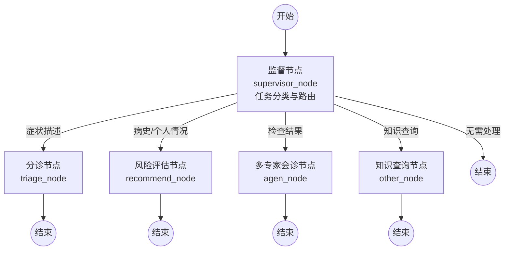

**图2-2 多专家会诊子流程图（agen_node内部）**
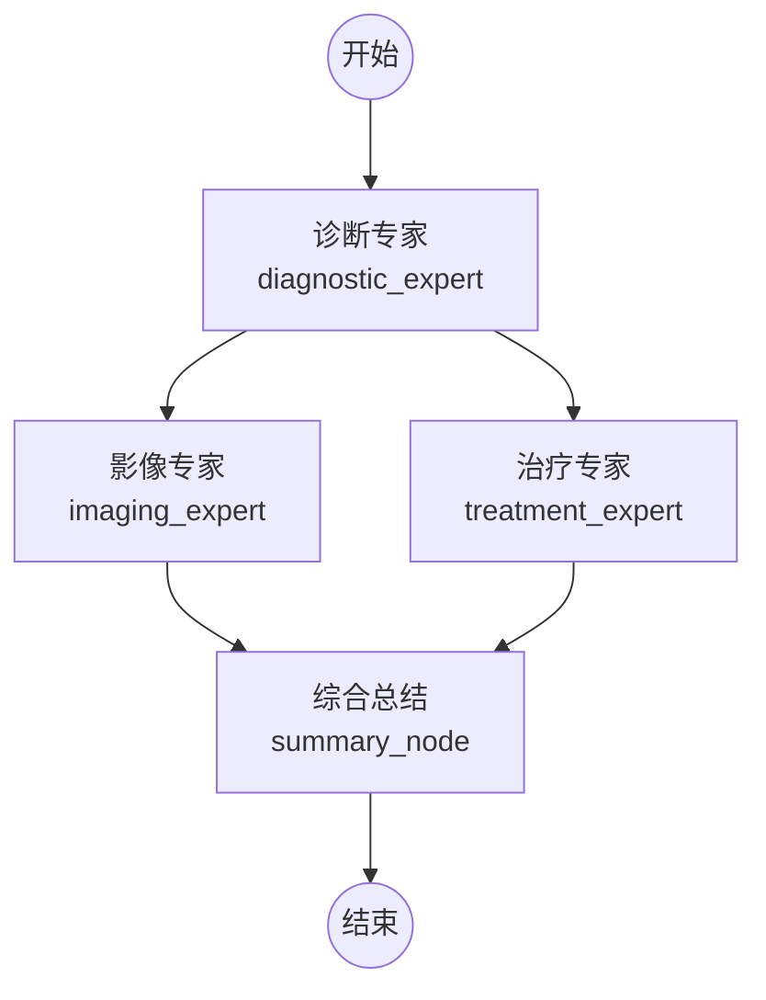

---

#### 2.4 知识图谱与Neo4j图数据库

💡 **写作思路（约2页）：**

第一部分：什么是知识图谱
- 知识图谱是用图的方式组织知识：实体作为节点，实体间的关系作为边
- 举例说明：(感冒) --[症状]--> (发热)，(感冒) --[治疗]--> (对乙酰氨基酚)
- 医学知识图谱的意义：将散落在文献中的知识结构化，便于计算机理解和检索

第二部分：知识图谱如何构建
- 简要说明一般流程：文本获取 → 实体识别 → 关系抽取 → 存入数据库
- 本系统的特点：使用LLM自动完成实体识别和关系抽取（传统方法需要大量人工标注，而LLM可以零样本完成）

第三部分：Neo4j图数据库
- Neo4j是最流行的图数据库，专门用于存储和查询图结构数据
- Cypher查询语言简单直观，举一个简单的查询示例：`MATCH (d:Disease)-[:HAS_SYMPTOM]->(s:Symptom) RETURN d, s`
- 本系统在Neo4j中存储了6种节点（疾病、症状、风险因子、病原体、治疗方法、诊断检查）

📚 **需要查找的文献（2篇）：**
- Ji S et al. "A Survey on Knowledge Graphs." IEEE TNNLS, 2021.（开题报告中已有）
- 一篇中文的医学知识图谱应用论文

📊 **需要提供的图：**
- 【图】知识图谱示例图（用"疾病-症状-治疗"举例，画几个节点和边即可）
- 【图】本系统Neo4j中实际存储的节点和关系类型（6种节点+5种关系的简图）

📐 **预绘图（Mermaid）：**

**图2-3 知识图谱示例（医学领域）**
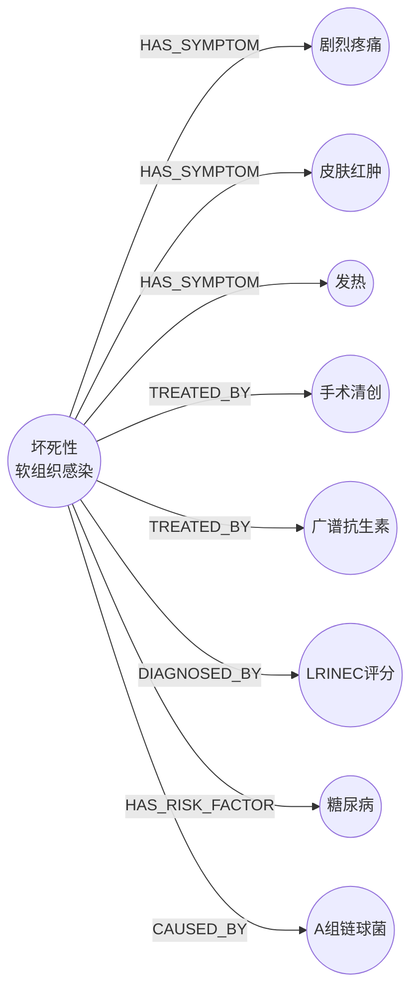

**图2-4 本系统Neo4j知识图谱数据模型**
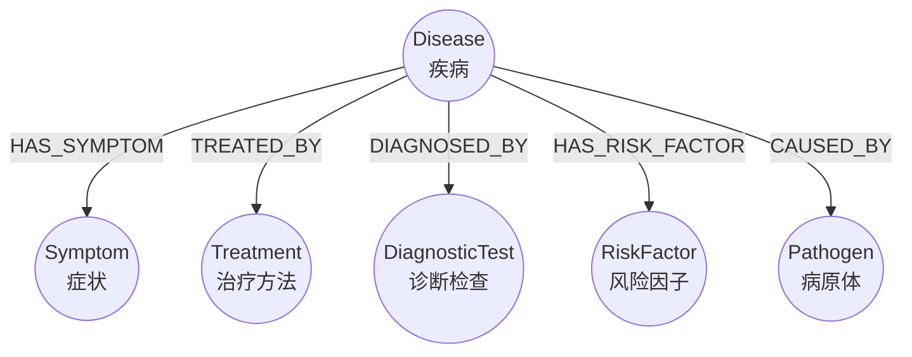

---

#### 2.5 检索增强生成（RAG）

💡 **写作思路（约1.5页）：**

第一部分：为什么需要RAG
- LLM的局限性：知识有截止日期、可能产生"幻觉"（编造不存在的信息）、无法获取私有数据
- RAG的核心思想：先检索相关知识，再让LLM参考这些知识来回答问题
- 类比：相当于考试时允许翻书，LLM"翻"的就是知识库

第二部分：RAG怎么工作
- 基本流程：用户提问 → 把问题转成向量 → 在知识库中检索相似内容 → 把检索结果和问题一起给LLM → LLM生成回答
- 文本向量化：用嵌入模型（本系统使用M3E-Base）把文字转成一串数字（向量），语义相近的文字向量也相近
- 向量检索：通过余弦相似度找到最相关的内容

第三部分：本系统的混合检索
- 本系统同时使用两种检索方式：
  - Neo4j知识图谱：精确查询结构化知识（如某个疾病有哪些症状）
  - Redis向量检索：语义匹配非结构化文献内容
- 不同场景选择不同检索策略，例如风险评估用知识图谱，会诊用向量检索

📚 **需要查找的文献（2篇）：**
- Lewis P et al. "Retrieval-Augmented Generation..." NeurIPS, 2020.（RAG原论文，引一下即可）
- 张伟等. 融合知识图谱的检索增强生成. 北京大学学报, 2024.（开题报告中已有）

📊 **需要提供的图：**
- 【图】RAG工作流程图（提问→检索→增强→生成，简单4步流程图）
- 【图】本系统混合检索策略示意图（知识图谱+向量检索双通道）

📐 **预绘图（Mermaid）：**

**图2-5 RAG工作流程图**


**图2-6 本系统混合检索策略**
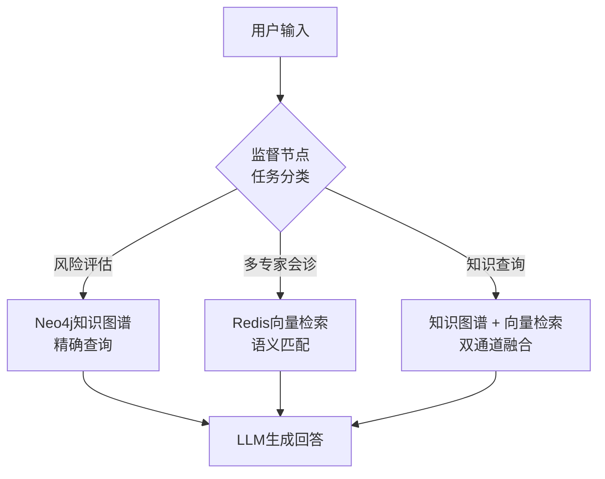

---

#### 2.6 模型上下文协议（MCP）

💡 **写作思路（约1页）：**
- MCP是什么：Anthropic公司发布的开放协议，让AI智能体能够以统一的标准接口调用各种外部工具
- 用类比解释：就像USB接口让各种设备可以用同一种方式连接电脑，MCP让智能体可以用同一种方式调用不同的工具
- MCP的三个角色：Host（发起调用的智能体）→ Client（通信层）→ Server（提供工具的服务）
- 本系统中的应用：
  - 服务端通过MCP暴露4个医学知识查询工具
  - 客户端智能体自动发现并调用这些工具
  - 好处：智能体不需要直接连接数据库，只需要调用MCP工具

📚 **需要查找的文献（1篇）：**
- MCP协议官方文档（https://modelcontextprotocol.io），以技术参考形式引用

📊 **需要提供的图：**
- 【图】MCP在本系统中的应用示意图（智能体 ↔ MCP ↔ 知识服务 ↔ 数据库）

📐 **预绘图（Mermaid）：**

**图2-7 MCP在本系统中的应用**
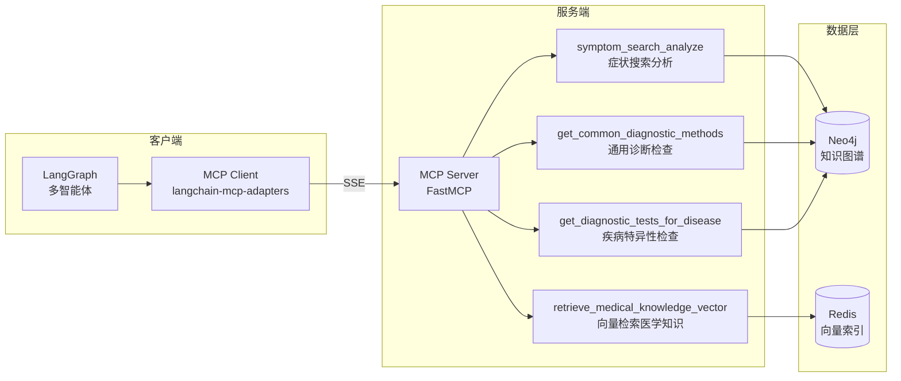

---

### 第三章 系统需求分析与总体设计

#### 3.1 系统需求分析

💡 **写作思路：**

**3.1.1 功能需求分析**
- 用用例图（Use Case Diagram）展示系统的主要功能
- 角色：医生（使用诊断端）、管理员（使用知识管理端）
- 医生侧功能：患者管理、智能分诊、风险评估、多专家会诊、知识查询、对话记录
- 管理员侧功能：PDF文献上传、知识图谱构建、图谱可视化、文档管理、数据导出

**3.1.2 非功能需求分析**
- 性能：单次分诊<5秒、知识图谱查询<2秒、支持10+并发
- 可用性：界面简洁直观、操作流程清晰
- 安全性：患者数据隔离、API访问控制
- 可扩展性：模块化设计、支持新增疾病领域

📊 **需要提供的图：**
- 【图】系统用例图（UML Use Case Diagram）—— 这是必须的！
- 【表格】功能需求列表（编号、功能名称、功能描述、优先级）
- 【表格】非功能需求列表

---

#### 3.2 系统总体架构设计

💡 **写作思路：**
- 描述三层架构：客户端层、服务端层、数据层
- 客户端层：多智能体协作引擎 + Vue3前端（诊断界面）
- 服务端层：REST API + MCP工具服务 + 知识图谱构建 + Vue3前端（管理界面）
- 数据层：Neo4j（知识图谱）+ Redis（向量索引）+ 文件系统（文档/日志）
- 通信方式：REST API、MCP(SSE)、SSE流式推送

📊 **需要提供的图（核心！）：**
- 【图】系统总体架构图 —— 这是论文最重要的图之一，建议用Visio或draw.io绘制
  - 展示三层架构、各组件、通信方式
  - 参考你项目文档中"四、技术实现"的架构描述

📐 **预绘图（Mermaid）：**

**图3-1 系统总体架构图**
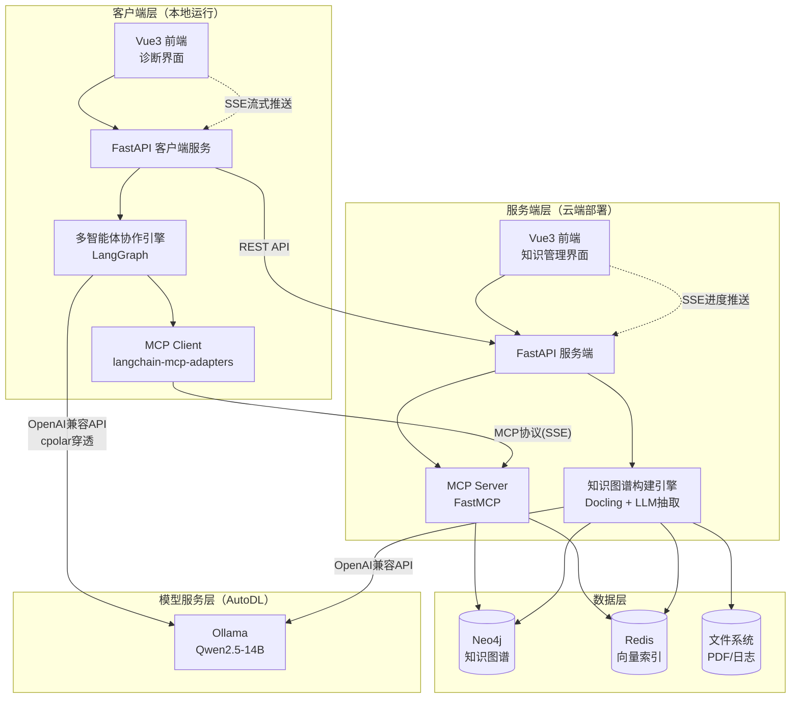

---

#### 3.3 功能模块设计

💡 **写作思路：**

**3.3.1 知识图谱构建模块**
- 七步流水线设计：PDF解析→HTML清洗→Markdown转换→文本分块→实体关系抽取→Neo4j导入→向量化
- 描述每一步的输入/输出
- 重点解释实体关系抽取的Prompt设计思路

**3.3.2 多智能体工作流模块**
- 五个节点的职责划分
- 状态图中的路由逻辑：supervisor如何根据输入类型分发任务
- 上下文感知路由：已分诊但未诊断时的强制路由逻辑

**3.3.3 MCP工具服务模块**
- 4个MCP工具的定义（symptom_search_analyze、get_diagnostic_tests_for_disease、get_common_diagnostic_methods、retrieve_medical_knowledge_vector）
- 每个工具的输入参数和返回格式
- SSE传输协议

**3.3.4 服务端知识管理模块**
- 这是服务端的核心业务层，提供10+个REST API接口，负责知识的全生命周期管理
- 主要功能：
  - **文档管理**：PDF上传、文档列表、文档加载、文档删除、知识图谱导出
  - **异步构建流程**：上传PDF后自动触发7步流水线（异步执行），通过SSE实时推送处理进度到前端
  - **数据一致性管理**：知识数据同时存在于Neo4j（图谱）、Redis（向量）、文件系统（JSON/Markdown）三个地方，需要保证三方数据一致，提供同步元数据、清理孤立资源等接口
  - **存储统计**：统计Neo4j节点/关系数量、Redis向量条目数、文件占用空间等

**3.3.5 分诊评估模块**
- 并行双智能体设计：医学顾问 + 急诊分诊
- 五级分诊标准的实现
- 综合分析节点的融合策略

**3.3.6 风险评估模块**
- 症状-疾病匹配流程
- Softmax概率计算算法
- 诊断检查推荐逻辑

**3.3.7 多专家会诊模块**
- 三专家角色：诊断专家、治疗专家、影像专家
- 基于RAG的知识检索策略
- 综合报告生成

**3.3.8 知识查询模块**
- ReAct智能体的实现
- MCP工具的集成调用

**3.3.9 患者数据管理模块**
- 患者CRUD操作
- 问诊记录的关联存储

📊 **需要提供的图：**
- 【图】知识图谱构建流水线流程图 —— 七步流程的清晰展示
- 【图】多智能体状态图（LangGraph） —— supervisor → triage/recommend/experts/query → END
- 【图】分诊节点并行处理流程图
- 【图】风险评估算法流程图（含Softmax计算步骤）
- 【图】多专家会诊流程图
- 【图】功能模块结构图（树状层级图）

📐 **预绘图（Mermaid）：**

**图3-2 功能模块结构图**
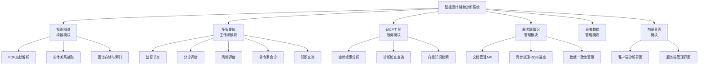

**图3-3 知识图谱构建七步流水线**
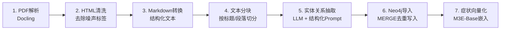

**图3-4 分诊节点并行处理流程**
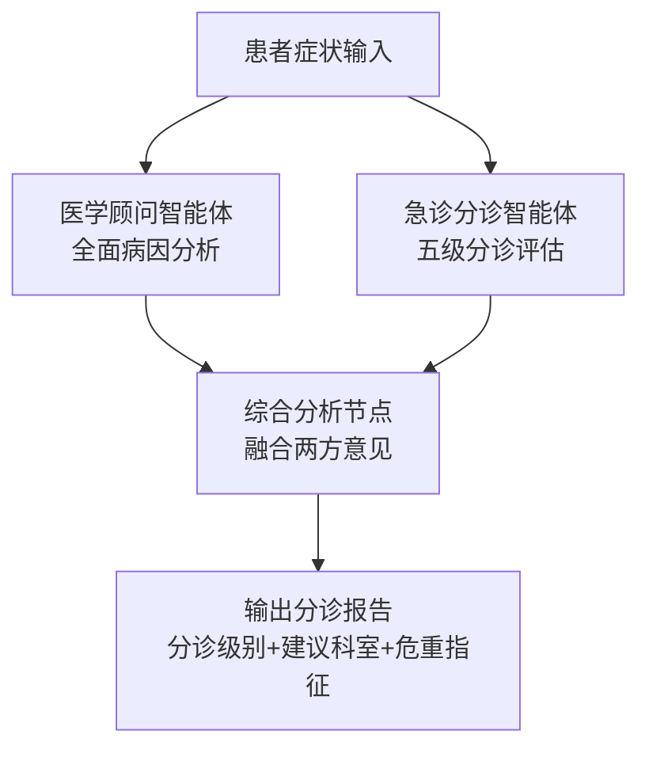

**图3-5 风险评估算法流程**
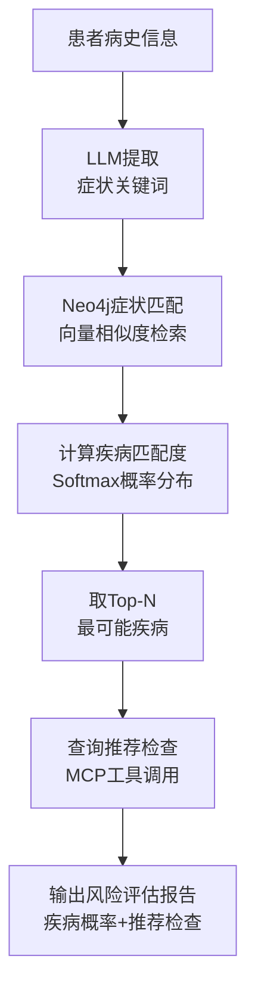

---

#### 3.4 数据库设计

💡 **写作思路：**

**3.4.1 Neo4j知识图谱数据模型**
- 6种节点类型：Disease、Symptom、RiskFactor、Pathogen、Treatment、DiagnosticTest
- 5种关系类型：HAS_SYMPTOM、HAS_RISK_FACTOR、HAS_PATHOGEN、HAS_TREATMENT、REQUIRES_TEST
- 每种节点和关系的属性定义

**3.4.2 Redis向量索引设计**
- 索引名称：medical_docs
- 向量维度：768（M3E-Base模型）
- 距离度量：余弦相似度（COSINE）
- 键格式：vec:medical_docs:{chunk_id}

**3.4.3 文件系统存储设计**
- Knowledges目录结构
- 患者数据存储格式

📊 **需要提供的图：**
- 【图】Neo4j知识图谱ER图/图模型设计图 —— 展示节点类型和关系类型（非常重要！）
- 【图】Neo4j中实际数据的截图（从Neo4j Browser中截取）
- 【表格】节点属性定义表
- 【表格】关系类型定义表
- 【表格】Redis索引字段定义表

---

#### 3.5 接口设计

💡 **写作思路：**
- 列出核心REST API接口（路径、方法、参数、返回值）
- 列出MCP工具接口定义
- SSE流式对话接口说明（POST /api/chat/stream）
- SSE进度推送接口说明（知识图谱构建进度实时推送）

📊 **需要提供的图：**
- 【表格】REST API接口列表（路径、方法、描述、参数）
- 【表格】MCP工具定义表（工具名、参数、返回值、描述）
- 【图】接口调用时序图（如：一次完整的分诊请求的调用链）

📐 **预绘图（Mermaid）：**

**图3-6 一次完整分诊请求的调用时序图**
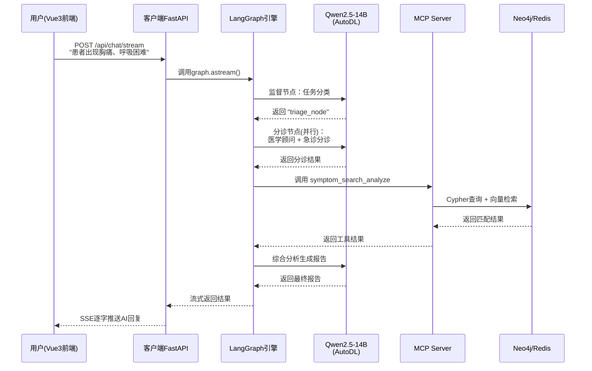

---

### 第四章 系统详细设计与实现

> 这是论文最核心的章节，需要展示关键代码片段和运行效果。

#### 4.1 知识图谱自动化构建实现

💡 **写作思路：**

**4.1.1 PDF文献解析（Docling）**
- 介绍Docling的工作原理
- 展示关键代码：DocumentConverter的调用
- 说明输出的HTML结构

**4.1.2 文本清洗与分块**
- 清洗策略：去除DOI之前内容、去除参考文献之后内容、删除多余空格
- 分块参数：chunk_size=2000, chunk_overlap=200
- 使用RecursiveCharacterTextSplitter的原因

**4.1.3 基于LLM的实体关系抽取**
- 实体类型和关系类型的定义（Pydantic模型）
- Prompt设计：给LLM什么样的指令来抽取实体和关系
- 展示一个抽取结果的JSON示例

**4.1.4 Neo4j图谱存储**
- 使用py2neo库操作Neo4j
- 节点和关系的创建代码
- 去重和合并策略

**4.1.5 症状向量化索引**
- M3E-Base模型生成768维向量
- 在Neo4j中创建向量索引（enhanced_symptom_vectors）
- 向量相似度检索的实现

📊 **需要提供的图：**
- 【图】PDF解析前后对比（原始PDF → 解析后HTML/Markdown）—— 截图
- 【图】实体关系抽取结果示例（JSON格式）
- 【图】Neo4j Browser中的知识图谱可视化截图 —— 非常重要！
- 【代码】关键代码片段（Docling调用、实体抽取Prompt、Neo4j存储）

📚 **需要查找的文献：**
- Docling技术文档（IBM开源项目）
- RecursiveCharacterTextSplitter的分块策略论文
- 句向量模型M3E的技术说明

---

#### 4.2 多智能体工作流实现

💡 **写作思路：**

**4.2.1 LangGraph状态图构建**
- State类的定义（TypedDict）
- StateGraph的构建过程：add_node → add_edge → add_conditional_edges → compile
- InMemorySaver实现多轮对话记忆

**4.2.2 监督节点——任务路由**
- Prompt设计：如何让LLM区分"症状描述"、"病史回答"、"检查结果"、"知识查询"
- 上下文感知路由：has_triaged和has_diagnosis的状态判断
- 展示路由结果的分类逻辑

**4.2.3 分诊节点——并行分诊**
- 两个智能体的角色设计（医学顾问 vs 急诊分诊）
- 并行执行机制
- 综合分析的融合策略
- 五级分诊标准的实现

**4.2.4 风险评估节点——Softmax概率计算**
- 症状匹配：从知识图谱中查询候选疾病
- 风险因子评分：计算每个疾病的风险因子匹配数
- Softmax公式及其在本场景的应用
- 诊断检查推荐的决策逻辑

**4.2.5 多专家会诊节点**
- RAG检索为每个专家提供知识支撑
- 三个专家的Prompt设计差异
- 综合报告的生成策略

**4.2.6 知识查询节点**
- create_react_agent的创建和配置
- ReAct推理循环：Thought → Action → Observation

📊 **需要提供的图：**
- 【图】LangGraph状态图的可视化（graph.get_graph().draw_mermaid()的输出）
- 【图】多轮对话流程示例截图
- 【图】分诊结果输出示例
- 【图】风险评估概率分布结果
- 【图】多专家会诊报告示例
- 【代码】关键代码片段（State定义、supervisor Prompt、Softmax计算、ReAct Agent创建）
- 【公式】Softmax概率计算公式（LaTeX格式）

📚 **需要查找的文献：**
- LangGraph官方文档
- ReAct论文："ReAct: Synergizing Reasoning and Acting in Language Models" (Yao et al., 2022)
- Softmax函数在概率归一化中的应用

---

#### 4.3 MCP工具服务实现

💡 **写作思路：**
- FastMCP框架的使用方式（@mcp.tool()装饰器）
- 每个工具的实现逻辑和返回数据结构
- SSE传输协议的配置

📊 **需要提供的图：**
- 【图】MCP工具调用时序图
- 【代码】MCP工具定义的关键代码

---

#### 4.4 服务端知识管理实现

💡 **写作思路：**

**4.4.1 知识管理REST API**
- 服务端使用FastAPI构建，提供完整的知识生命周期管理接口
- 列出核心API（用表格）：
  - `POST /api/knowledge/upload` —— 上传PDF文献
  - `POST /api/knowledge/extract` —— 触发实体关系抽取
  - `POST /api/knowledge/build` —— 构建知识图谱（写入Neo4j + 向量化）
  - `GET /api/knowledge/list` —— 文档列表
  - `GET /api/knowledge/load/{name}` —— 加载文档知识数据
  - `DELETE /api/knowledge/delete/{name}` —— 删除文档（同时清理Neo4j、Redis、文件）
  - `GET /api/knowledge/stats` —— 存储统计（节点数、关系数、向量条目数）
- 展示一个关键接口的代码片段即可

**4.4.2 异步处理与SSE进度推送**
- PDF处理是耗时操作（几分钟），采用异步后台任务 + SSE实时推送进度
- 实现方式：上传接口立即返回task_id → 后台asyncio协程执行7步流水线 → 每完成一步通过PDFProgressTracker更新进度 → 前端用EventSource订阅`/api/knowledge/progress/{task_id}`接收实时进度
- 展示进度推送的关键代码（PDFProgressTracker类）

**4.4.3 数据一致性管理**
- 知识数据分散在三个存储中：Neo4j（实体关系图谱）、Redis（文本向量索引）、文件系统（JSON/Markdown原始数据）
- 挑战：删除文档时需要同时清理三方数据；异常中断可能导致数据不一致
- 解决方案：KnowledgeDataManager统一管理，提供sync-metadata（同步元数据）和cleanup-orphaned（清理孤立资源）接口
- 可以展示删除接口如何同时清理三个存储的代码

📊 **需要提供的图：**
- 【表格】服务端知识管理核心API列表
- 【图】异步处理与SSE进度推送时序图

📐 **预绘图（Mermaid）：**

**图4-2 PDF上传异步处理与进度推送流程**
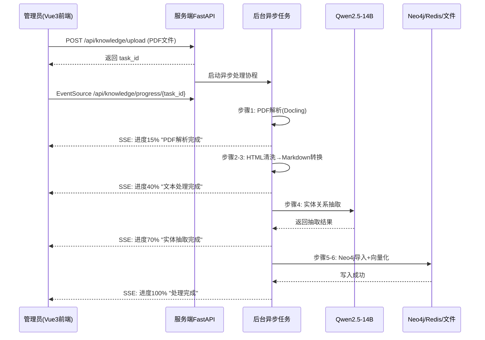

---

#### 4.5 前端界面实现

💡 **写作思路：**

**4.5.1 客户端诊断界面**
- 三栏布局：患者列表 | 患者详情 | AI对话面板
- 组件设计：PatientList.vue、PatientDetail.vue、ChatPanel.vue
- 流式对话的实现（SSE）：前端通过fetch接收StreamingResponse，逐字显示AI回复

**4.5.2 服务端知识管理界面**
- 文献上传与处理进度（对接上面4.4.2的SSE进度推送）
- 知识图谱可视化（ECharts）
- 实体关系管理

📊 **需要提供的图（此节截图最多）：**
- 【截图】客户端主界面全景
- 【截图】患者列表页面
- 【截图】AI对话界面（展示一次完整的分诊对话）
- 【截图】服务端知识管理主界面
- 【截图】PDF上传和处理进度界面
- 【截图】知识图谱可视化界面
- 【截图】实体关系编辑界面

---

#### 4.6 系统部署实现

💡 **写作思路：**

**LLM模型部署（重点写）：**
- 使用AutoDL云GPU服务器租用GPU算力（如RTX 4090等）
- 通过Ollama部署Qwen2.5-14B模型，Ollama提供OpenAI兼容的API接口
- 使用cpolar内网穿透将AutoDL内网端口(6006)暴露为固定公网域名（zjlchat.vip.cpolar.cn）
- 这样客户端和服务端都可以通过公网域名调用LLM，无需本地GPU
- 可以贴一下start.sh启动脚本的关键部分，说明一键启动流程

**其他部署：**
- Docker容器化：服务端的Neo4j、Redis等通过docker-compose编排
- 混合部署方案：客户端本地运行 + 服务端云端部署 + LLM在AutoDL上独立部署
- 客户端通过PyInstaller/Electron打包为可执行文件

📊 **需要提供的图：**
- 【图】部署架构图（三部分：客户端本地 ↔ 服务端云端 ↔ AutoDL模型服务器，标注cpolar穿透）

📐 **预绘图（Mermaid）：**

**图4-1 系统部署架构图**
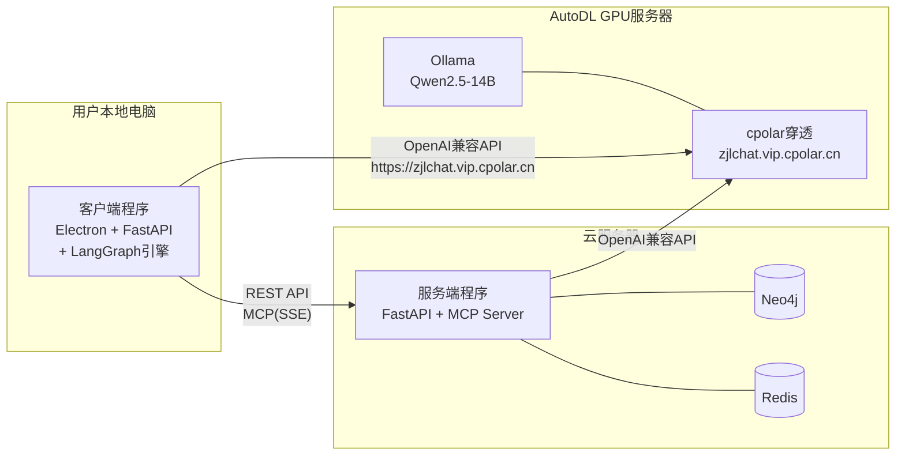

---

### 第五章 系统测试

#### 5.1 测试环境

💡 **写作思路：**
- 列出硬件环境（CPU、内存、GPU、磁盘）
- 列出软件环境（OS、Python版本、Neo4j版本、Redis版本、浏览器）
- 列出LLM模型信息（Qwen2.5-14B）

📊 **需要提供的图：**
- 【表格】测试环境配置表

---

#### 5.2 功能测试

💡 **写作思路：**
- 每个功能模块设计2-3个测试用例
- 每个用例包括：测试编号、测试目标、测试输入、预期结果、实际结果、是否通过
- 用表格+截图展示

**5.2.1 知识图谱构建测试**
- 测试用例：上传一份急诊医学PDF → 验证知识图谱是否正确构建
- 验证点：实体数量、关系数量、向量索引是否创建

**5.2.2 智能分诊测试**
- 测试用例：输入"患者出现胸痛、呼吸困难" → 验证分诊结果是否合理
- 验证点：分诊级别、建议科室、危重指征

**5.2.3 风险评估测试**
- 测试用例：输入患者病史信息 → 验证疾病概率分布
- 验证点：最可能疾病、概率值、推荐检查

**5.2.4 多专家会诊测试**
- 测试用例：提交检查结果 → 验证多专家报告
- 验证点：三个专家的意见、综合诊断结论

**5.2.5 知识查询测试**
- 测试用例：查询"什么是坏死性软组织感染？" → 验证回答质量
- 验证点：回答准确性、引用来源

📊 **需要提供的图：**
- 【表格】测试用例表（每个模块一个表格）
- 【截图】关键测试结果的系统截图

---

#### 5.3 性能测试

💡 **写作思路：**
- 响应时间测试：各节点的处理时间
- 并发测试：多用户同时使用时的表现
- 用表格和折线图展示

📊 **需要提供的图：**
- 【表格】各功能模块响应时间统计表
- 【图】响应时间对比柱状图

---

### 第六章 总结与展望

#### 6.1 总结

💡 **写作思路：**
- 回顾论文的主要工作和成果（3-4段）
- 强调创新点：多智能体协作架构、知识图谱自动化构建、MCP协议应用、混合RAG
- 总结系统达到的效果

---

#### 6.2 不足与展望

💡 **写作思路：**
- **不足**：
  - 知识图谱目前仅覆盖4个急诊疾病领域，规模有限
  - LLM推理存在幻觉风险，需要更强的事实校验机制
  - 缺乏真实临床环境的验证
  - 性能优化空间：LLM推理延迟、向量检索效率
- **展望**：
  - 扩展到更多专科领域
  - 引入多模态（影像、检验报告）
  - 对接医院HIS/LIS/PACS系统
  - 加强安全审计和合规性
  - 探索联邦学习保护患者隐私

---

### 参考文献

💡 **写作思路：**
- 本科论文建议15-20篇参考文献即可
- 中英文比例约各半
- 开题报告已有10篇，再补5-8篇就够

📚 **已有文献（开题报告中，10篇）：**
1. 国家卫健委. 关于促进和规范"人工智能+医疗卫生"应用发展的实施意见. 2025.
2. Lin T et al. HuatuoGPT. arXiv:2305.15075, 2023.
3. Huang K et al. ClinicalBERT. arXiv:1904.05342, 2020.
4. Tu T et al. Med-PaLM 2. arXiv:2311.16452, 2023.
5. Ji S et al. A Survey on Knowledge Graphs. IEEE TNNLS, 2021.
6. 李昊等. 基于联合学习的中文电子病历实体与关系抽取. 计算机科学与探索, 2023.
7. 张伟等. 融合知识图谱的检索增强生成. 北京大学学报, 2024.
8. 医渡科技. Bianque. 2023.
9. 刘永磊等. 基于中间件技术的医院信息集成平台. 中国数字医学, 2022.
10. Lee J et al. BioBERT. Bioinformatics, 2020.

📚 **建议再补充5-8篇：**
- Vaswani A et al. "Attention Is All You Need." NeurIPS, 2017.（Transformer，第二章提到时引用）
- Lewis P et al. "Retrieval-Augmented Generation..." NeurIPS, 2020.（RAG原论文）
- Yao S et al. "ReAct..." ICLR, 2023.（智能体推理-行动模式）
- 一篇中文的多智能体综述或LLM应用综述
- MCP协议官方文档（https://modelcontextprotocol.io）
- 1-2篇你实际参考过的技术博客或文档（LangGraph、Neo4j等，以网络资源形式引用）

---

### 致谢

💡 **写作思路：**
- 感谢导师的指导
- 感谢学校和学院提供的学习环境
- 感谢开源社区（LangChain、Neo4j、Docling等）
- 感谢家人和朋友的支持
- 300-500字即可

---

## 附录：图表清单汇总

> 以下是论文中建议包含的所有图表，方便集中准备。

### 建议提供的图（共约20张）

| 序号 | 图表类型 | 内容描述 | 所在章节 | 来源 |
|------|----------|----------|----------|------|
| 1 | 表格 | 核心依赖库版本清单 | 2.1 | 从requirements文件整理 |
| 2 | 示意图 | Transformer架构示意图 | 2.2 | 网上找标准图，标注出处 |
| 3 | 示意图 | 本系统多智能体架构图 | 2.3 | 自绘（supervisor→4节点） |
| 4 | 示意图 | 知识图谱示例图 | 2.4 | 自绘（疾病-症状-治疗举例） |
| 5 | 示意图 | RAG工作流程图 | 2.5 | 自绘（提问→检索→生成） |
| 6 | 示意图 | MCP在本系统中的应用图 | 2.6 | 自绘 |
| 7 | UML图 | 系统用例图 | 3.1 | 自绘（Visio/draw.io） |
| 8 | 架构图 | **系统总体架构图** | 3.2 | 自绘（**最重要！**） |
| 9 | 结构图 | 功能模块结构图 | 3.3 | 自绘 |
| 10 | 流程图 | 知识图谱构建流水线 | 3.3.1 | 自绘 |
| 11 | 状态图 | 多智能体LangGraph状态图 | 3.3.2 | 自绘/LangGraph导出 |
| 12 | 图模型 | Neo4j节点和关系模型 | 3.4.1 | 自绘 |
| 13 | 表格 | REST API / MCP接口列表 | 3.5 | 从代码整理 |
| 14 | 截图 | Neo4j知识图谱可视化 | 4.1 | Neo4j Browser截图 |
| 15 | 截图 | 客户端诊断主界面 | 4.4.1 | 系统运行截图 |
| 16 | 截图 | AI对话界面（展示一次分诊） | 4.4.1 | 系统运行截图 |
| 17 | 截图 | 服务端知识管理界面 | 4.4.2 | 系统运行截图 |
| 18 | 表格 | 测试环境配置表 | 5.1 | 整理 |
| 19 | 表格 | 功能测试用例表 | 5.2 | 设计 |
| 20 | 截图 | 关键测试结果截图 | 5.2 | 系统运行截图 |

---

## 附录：写作建议（本科毕业论文）

1. **全文字数**：建议1.5-2万字（不含代码和附录），各章节大致分配：
   - 第一章 前言：约3000字
   - 第二章 技术基础：约4000字（每节1-2页，不需要太深）
   - 第三章 系统设计：约4000字
   - 第四章 系统实现：约5000字（此章最长，多放截图和代码）
   - 第五章 测试：约2000字
   - 第六章 总结：约1000字
2. **参考文献**：15-20篇即可，中英文各半。开题报告已有10篇，再补5-10篇
3. **代码展示**：第四章中适度展示关键代码片段（每处不超过15行），配合文字说明
4. **图表编号**：统一使用"图X-Y"和"表X-Y"格式（X=章号，Y=序号）
5. **参考文献格式**：按学校要求统一使用GB/T 7714格式
6. **查重注意**：
   - 第二章技术介绍最容易重复率高，**务必用自己的话重新组织**，多结合本系统的具体应用来写
   - 代码部分建议以截图形式放入，不算查重
   - 需求分析和系统设计部分结合自己项目的特点来写，避免套话
7. **写作顺序建议**：第三章 → 第四章 → 第二章 → 第五章 → 第一章 → 第六章 → 摘要
8. **本科论文常见问题提醒**：
   - 第二章不要变成技术手册，每个技术点写清"是什么、为什么用它"就够了
   - 第四章是论文重点，要多展示你实际做了什么（代码+截图+运行效果）
   - 第五章测试不要只说"通过了"，要有具体的测试用例和结果截图
   - 避免大段复制粘贴官方文档或教科书内容
