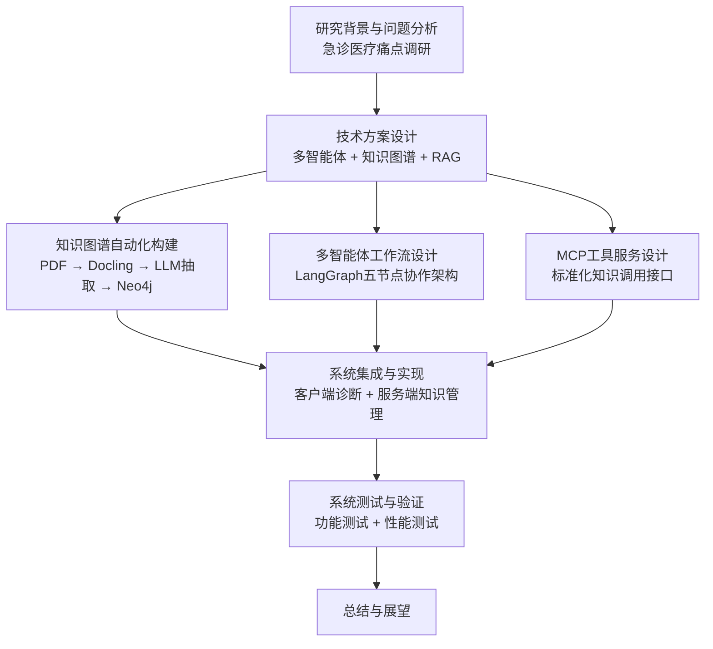
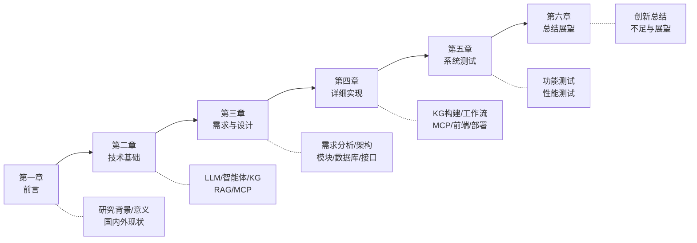

# 第一章 前言 — 图表

---

## 图 1-1 本文研究技术路线图

```mermaid
graph TD
    A[研究背景与问题分析<br/>急诊医疗痛点调研] --> B[技术方案设计<br/>多智能体 + 知识图谱 + RAG]
    B --> C1[知识图谱自动化构建<br/>PDF → Docling → LLM抽取 → Neo4j]
    B --> C2[多智能体工作流设计<br/>LangGraph五节点协作架构]
    B --> C3[MCP工具服务设计<br/>标准化知识调用接口]
    C1 --> D[系统集成与实现<br/>客户端诊断 + 服务端知识管理]
    C2 --> D
    C3 --> D
    D --> E[系统测试与验证<br/>功能测试 + 性能测试]
    E --> F[总结与展望]
```

---

## 图 1-2 论文章节组织结构图

```mermaid
graph LR
    CH1[第一章<br/>前言] --> CH2[第二章<br/>技术基础]
    CH2 --> CH3[第三章<br/>需求与设计]
    CH3 --> CH4[第四章<br/>详细实现]
    CH4 --> CH5[第五章<br/>系统测试]
    CH5 --> CH6[第六章<br/>总结展望]

    CH1 -.- N1[研究背景/意义<br/>国内外现状]
    CH2 -.- N2[LLM/智能体/KG<br/>RAG/MCP]
    CH3 -.- N3[需求分析/架构<br/>模块/数据库/接口]
    CH4 -.- N4[KG构建/工作流<br/>MCP/前端/部署]
    CH5 -.- N5[功能测试<br/>性能测试]
    CH6 -.- N6[创新总结<br/>不足与展望]
```
