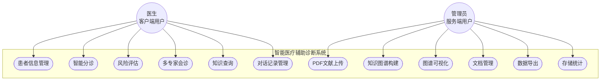
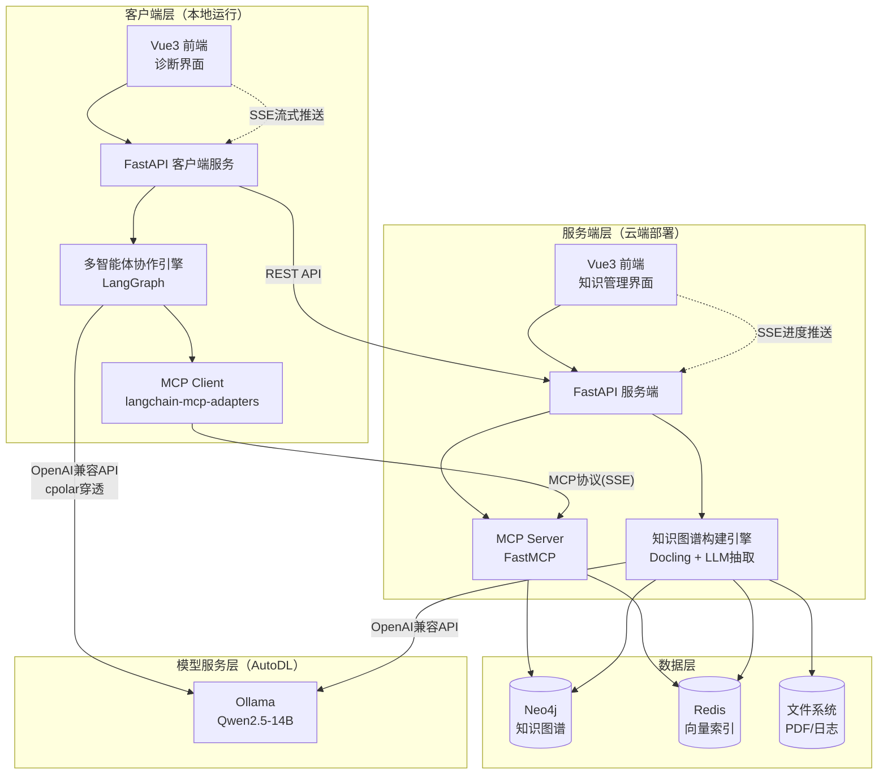
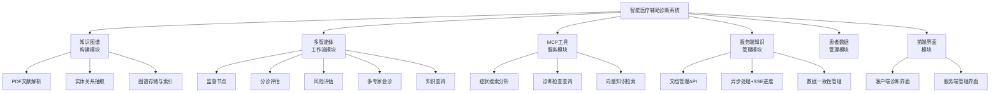
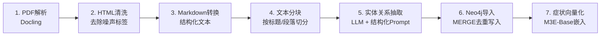
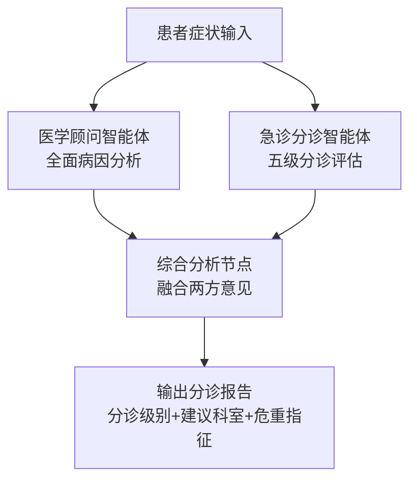
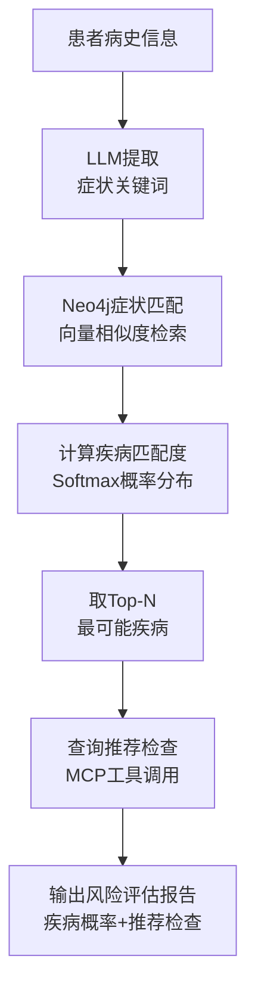
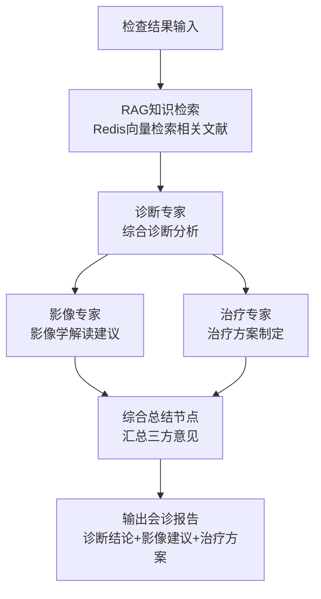
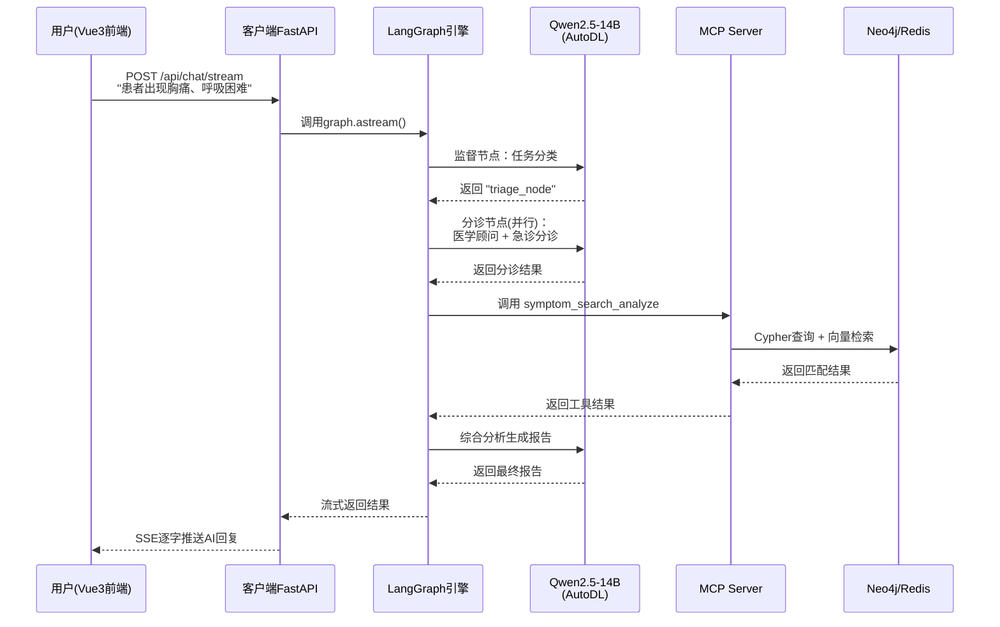
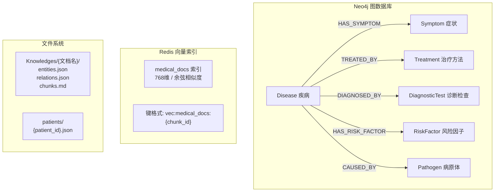

# 第三章 系统需求分析与总体设计 — 图表

---

## 图 3-1 系统用例图

---

## 图 3-2 系统总体架构图

---

## 图 3-3 功能模块结构图

---

## 图 3-4 知识图谱构建七步流水线

---

## 图 3-5 分诊节点并行处理流程

---

## 图 3-6 风险评估算法流程

---

## 图 3-7 多专家会诊流程

---

## 图 3-8 一次完整分诊请求的调用时序图

---

## 图 3-9 数据库整体设计关系图

