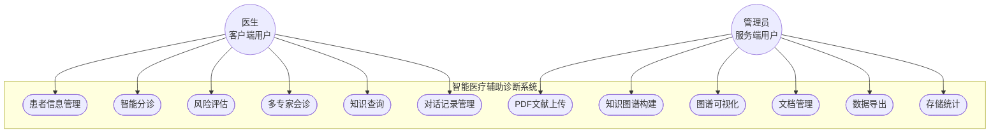

## 3.1 系统需求分析
**3.1.1 功能需求分析 **

 
本系统的功能需求分析如图3-1所示。主要服务于两类用户：一类是需要进行复杂医学推理的客户端（医院、医学教育等机构），一类是需要进行构建高质量医疗知识的服务端（知识中心）。客户端有以下功能：（1）患者管理、（2）智能分诊、（3）风险评估、（4）多专家会诊、（5）知识查询、（6）对话记录。服务端有以下功能：（1）PDF 文献上传、（2）知识图谱构建、（3）图谱可视化、（4）文档管理、（5）数据导出

**3.1.2 非功能需求分析 **
**性能需求：** 
- 系统响应时间：单次智能分诊处理时间不超过5秒，知识图谱查询响应时间小于2秒 
- 并发处理能力：支持至少10个用户同时在线使用 
- 数据处理效率：单份医学文献的知识图谱构建时间控制在30分钟以内 
 **可用性需求：** 
 - 界面设计：采用简洁直观的Vue3前端框架，操作流程符合医生使用习惯
 - 系统稳定性：保证99%的正常运行时间，故障恢复时间不超过30分钟 
 - 用户体验：提供清晰的操作指引和错误提示信息 
 **安全性需求：** 
 - 数据隔离：不同医疗机构的患者数据实现物理隔离存储 
 - 隐私保护：严格遵循医疗数据保护相关法规要求 
 **可扩展性需求：** 
 - 架构设计：采用模块化设计思想，便于新增疾病领域知识 
 - 技术选型：选用主流开源技术栈，降低后期维护成本 
 - 接口标准化：遵循RESTful API设计规范，支持第三方系统集成

## 3.2 系统总体架构设计
本系统采用三层架构：