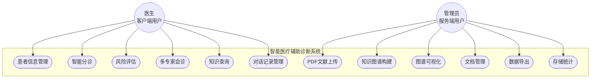

# 第三章 系统需求分析与总体设计

## 3.1 系统需求分析

### 3.1.1 功能需求分析

> **【第1段：用例图+两类角色】** 用下面的Mermaid用例图展示系统功能全景。说明两个角色：医生（客户端）和管理员（服务端）。



> **【第2段：功能列表描述】** 分客户端/服务端两部分逐条列出功能。客户端6项（患者管理/智能分诊/风险评估/多专家会诊/知识查询/对话记录），服务端6项（PDF上传/KG构建/图谱可视化/文档管理/数据导出/存储统计）。可配一张功能需求列表表格（编号/名称/描述/优先级）。

### 3.1.2 非功能需求分析

> **【分4个维度，每个维度2-3条要点】** 性能/可用性/安全性/可扩展性各写一小段：
> - **性能：** 分诊<5秒、KG查询<2秒、10+并发、单文献构建<30分钟
> - **可用性：** Vue3简洁界面、99%运行时间、清晰操作指引
> - **安全性：** 患者数据隔离存储、遵循医疗数据保护法规
> - **可扩展性：** 模块化设计、主流开源技术栈、RESTful API标准化


## 3.2 系统总体架构设计

> **【第1段：总述】** 一句概括："三层架构 + 模型服务层"。配系统总体架构图（图表.md中有Mermaid图）。

> **【第2段：客户端层】** 核心=LangGraph五节点多智能体引擎。前端=Vue3诊断界面。通过MCP连接服务端知识工具，REST API做数据交互。

> **【第3段：服务端层】** 两类接口：REST API（端口8000，FastAPI）+ MCP工具服务（端口8002，FastMCP，SSE传输）。还含KG构建服务和Vue3管理界面。

> **【第4段：数据层】** 三类存储：Neo4j（知识图谱）、Redis（向量索引）、文件系统（PDF/中间文件/患者数据）。

> **【第5段：模型服务层】** Qwen2.5-14B部署：AutoDL云GPU → Ollama → cpolar穿透为公网OpenAI兼容接口。

> **【第6段：通信方式】** 三种：REST API（数据交互）、MCP over SSE（工具调用）、SSE流式推送（对话+构建进度）。

## 3.3 功能模块设计

### 3.3.1 知识图谱构建模块

> **【第1段：七步流水线概述】** 列出七步及每步输入/输出：
> 1. PDF解析（Docling → HTML）
> 2. HTML清洗（去DOI/参考文献/空格）
> 3. Markdown转换
> 4. 文本分块（RecursiveCharacterTextSplitter, chunk_size=2000, overlap=200）
> 5. 实体关系抽取（LLM零样本 → JSON，6种实体+5种关系）
> 6. Neo4j导入（py2neo, MERGE去重）
> 7. 向量化（M3E-Base 768维，Neo4j症状向量索引HNSW + Redis文档向量索引FLAT）

> **【第2段：重点解释实体关系抽取的Prompt设计】** 给LLM什么指令、Pydantic模型约束、输出JSON示例。可配流程图（图表.md中有）。

### 3.3.2 多智能体工作流模块

> **【第1段：五节点职责总览】** 列表说明各节点：
> - supervisor_node：任务分类与路由（LLM意图识别）
> - triage_node：并行分诊（医学顾问 + 急诊分诊双智能体）
> - recommend_node：风险评估（症状匹配 + Softmax概率）
> - agen_node：多专家会诊（诊断/治疗/影像三专家 + RAG）
> - other_node：知识查询（ReAct + MCP工具）

> **【第2段：supervisor路由逻辑】** 按输入类型分发：症状→triage，病史/检查→recommend，请求会诊→agen，知识问题→other。上下文感知路由：has_triaged / has_diagnosis 状态判断避免重复。

### 3.3.3 MCP工具服务模块

> **【第1段：概述+工具表格】** FastMCP框架，SSE传输，端口8002。直接用下表：

| 工具名称 | 功能描述 | 输入参数 | 返回格式 |
|----------|----------|----------|----------|
| symptom_search_analyze | 症状向量检索与疾病分析 | 症状描述文本 | 匹配疾病列表及关联信息 |
| get_common_diagnostic_methods | 通用诊断方法查询 | 无/疾病名称 | 诊断方法列表 |
| get_diagnostic_tests_for_disease | 特定疾病诊断检查查询 | 疾病名称 | 该疾病推荐的检查项目 |
| retrieve_medical_knowledge_vector | Redis向量检索医学知识 | 查询文本 | 语义最相关的知识片段 |

> **【第2段：工具发现机制】** 客户端通过MCP协议自动发现工具并调用，实现知识服务与智能体解耦。

### 3.3.4 服务端知识管理模块

> **【第1段：模块概述】** 基于FastAPI，10+个REST API接口。

> **【第2段：文档管理】** 列举CRUD操作：upload/list/load/delete/export。

> **【第3段：异步处理】** 为什么异步——KG构建耗时。方案：上传返回task_id → asyncio协程后台执行 → PDFProgressTracker追踪 → SSE推送进度到前端。

> **【第4段：数据一致性】** 三方存储（Neo4j+Redis+文件系统）同步挑战。KnowledgeDataManager统一管理，sync-metadata + cleanup-orphaned 接口。

### 3.3.5 分诊评估模块

> **【1段】** 并行双智能体：智能体1=医学顾问（MCP工具调KG），智能体2=急诊分诊护士（五级分诊：I濒危/II危重/III急症/IV亚急症/V非急症）。并行执行后综合分析节点融合→输出分诊级别+建议科室+危重指征。

### 3.3.6 风险评估模块

> **【1段】** 流程三步：①Neo4j查询症状匹配疾病及风险因子 ②计算匹配得分→Softmax转概率分布 ③推荐最可能疾病+诊断检查。可写出Softmax公式。

### 3.3.7 多专家会诊模块

> **【1段】** 模拟MDT：诊断专家（分析病史+检查）、治疗专家（方案建议）、影像专家（影像分析）。每个专家先RAG检索知识支撑，最终综合报告节点汇总。

### 3.3.8 知识查询模块

> **【1段】** create_react_agent创建ReAct智能体，集成MCP工具集。推理循环：Thought→Action→Observation，自主选择工具并生成回答。

### 3.3.9 患者数据管理模块

> **【1段】** CRUD操作，JSON格式存储在patient_data/。每个患者关联问诊对话历史。

## 3.4 数据库设计

### 3.4.1 Neo4j知识图谱数据模型

> **【第1段：概述+节点表】** 6种节点+5种关系，直接用下面两张表：

| 节点类型 | 中文名称 | 核心属性 |
|----------|----------|----------|
| Disease | 疾病 | name, description |
| Symptom | 症状 | name, description |
| RiskFactor | 风险因子 | name, description |
| Pathogen | 病原体 | name, type |
| Treatment | 治疗方法 | name, description, type |
| DiagnosticTest | 诊断检查 | name, description, type |

| 关系类型 | 含义 | 起点→终点 |
|----------|------|-----------|
| HAS_SYMPTOM | 具有症状 | Disease → Symptom |
| HAS_RISK_FACTOR | 具有风险因子 | Disease → RiskFactor |
| HAS_PATHOGEN | 具有病原体 | Disease → Pathogen |
| HAS_TREATMENT | 具有治疗方法 | Disease → Treatment |
| REQUIRES_TEST | 需要诊断检查 | Disease → DiagnosticTest |

> **【第2段：向量索引】** Symptom节点上的enhanced_symptom_vectors索引：768维，余弦相似度，HNSW算法（ANNS）。

### 3.4.2 Redis向量索引设计

> **【1段+配置表】** 索引名medical_docs，直接用下表：

| 配置项 | 值 |
|--------|-----|
| 索引名称 | medical_docs |
| 键格式 | vec:medical_docs:{chunk_id} |
| 向量维度 | 768 |
| 向量类型 | FLOAT32 |
| 距离度量 | COSINE |
| 索引算法 | FLAT（精确最近邻） |
| 存储字段 | vector, content, metadata, chunk_id |

### 3.4.3 文件系统存储设计

> **【1段+目录树】** 一句概述后直接用目录结构：

```
Knowledges/                          # 知识库根目录
├── {文献名称}/                       # 每个文献的处理目录
│   ├── {文献名称}.pdf               # 原始PDF
│   ├── {文献名称}.html              # Docling解析结果
│   ├── {文献名称}_cleaned.html      # 清洗后的HTML
│   ├── {文献名称}.md                # Markdown格式
│   └── {文献名称}_entities.json     # 实体抽取结果
├── _metadata.json                   # 知识库元数据
patient_data/                        # 患者数据目录
└── {patient_id}.json                # 患者记录（JSON格式）
temp_uploads/                        # 临时上传目录
```

## 3.5 接口设计

### 3.5.1 REST API接口设计

> **【1段+接口表】** 一句概述后直接用下表：

| 方法 | 路径 | 功能描述 |
|------|------|----------|
| POST | /api/upload | 上传PDF文献 |
| POST | /api/extract | 执行知识抽取 |
| POST | /api/build | 执行知识图谱构建 |
| GET | /api/documents | 获取文档列表 |
| GET | /api/documents/{id} | 获取文档详情 |
| DELETE | /api/documents/{id} | 删除文档 |
| GET | /api/processing-status/{task_id} | 查询处理状态 |
| GET | /api/stats | 获取存储统计信息 |
| POST | /api/sync-metadata | 同步元数据 |
| POST | /api/cleanup-orphaned | 清理孤立数据 |
| GET | /api/patients | 获取患者列表 |
| POST | /api/patients | 创建患者记录 |
| PUT | /api/patients/{id} | 更新患者记录 |
| DELETE | /api/patients/{id} | 删除患者记录 |

### 3.5.2 MCP工具接口设计

> **【1段】** SSE传输（端口8002），工具定义见3.3.3表。描述调用流程：连接→list_tools获取工具定义→call_tool调用→tool_result返回结果。

### 3.5.3 SSE实时通信接口

> **【1段】** 两类SSE接口：①对话流式——LLM文本逐字推送到前端 ②构建进度——PDFProgressTracker推送各步骤进度和状态。

## 3.6 本章小结

> **【1段】** 串联本章内容：需求分析（功能+非功能）→ 总体架构（三层+模型服务层）→ 9个功能模块设计 → 数据库设计（Neo4j/Redis/文件系统）→ 接口设计（REST API/MCP/SSE）。末句："为第四章的详细实现提供了指导。"