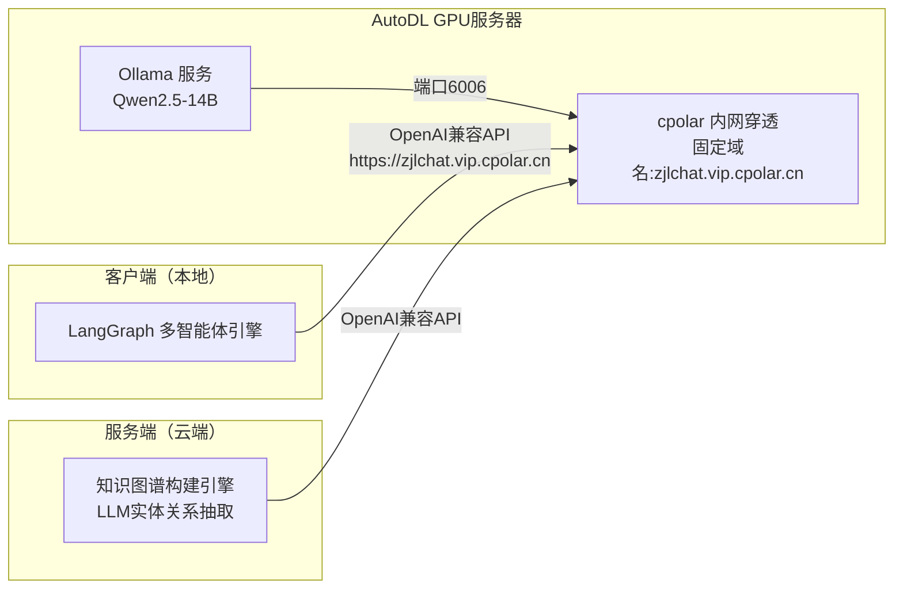
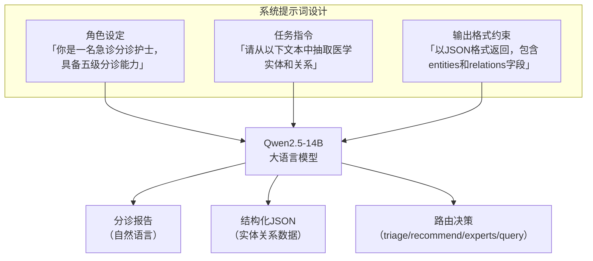
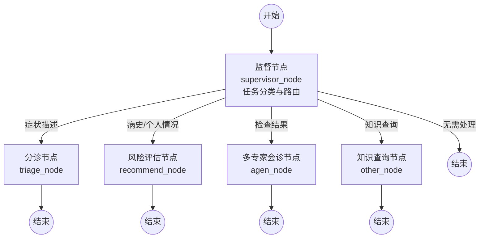
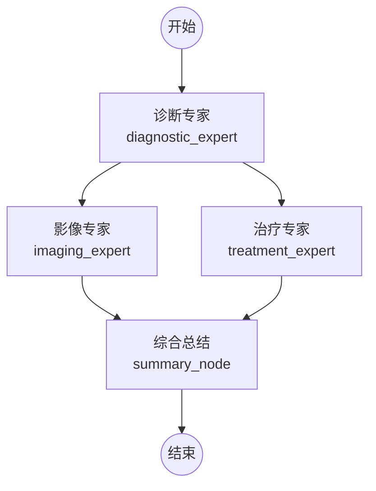
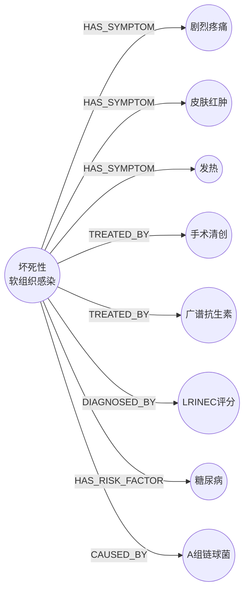
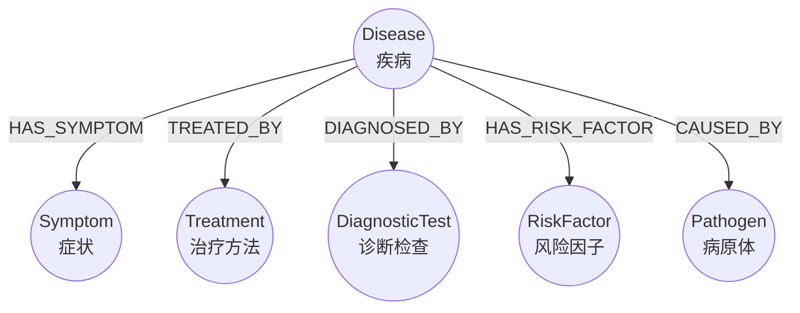
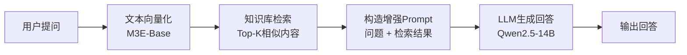
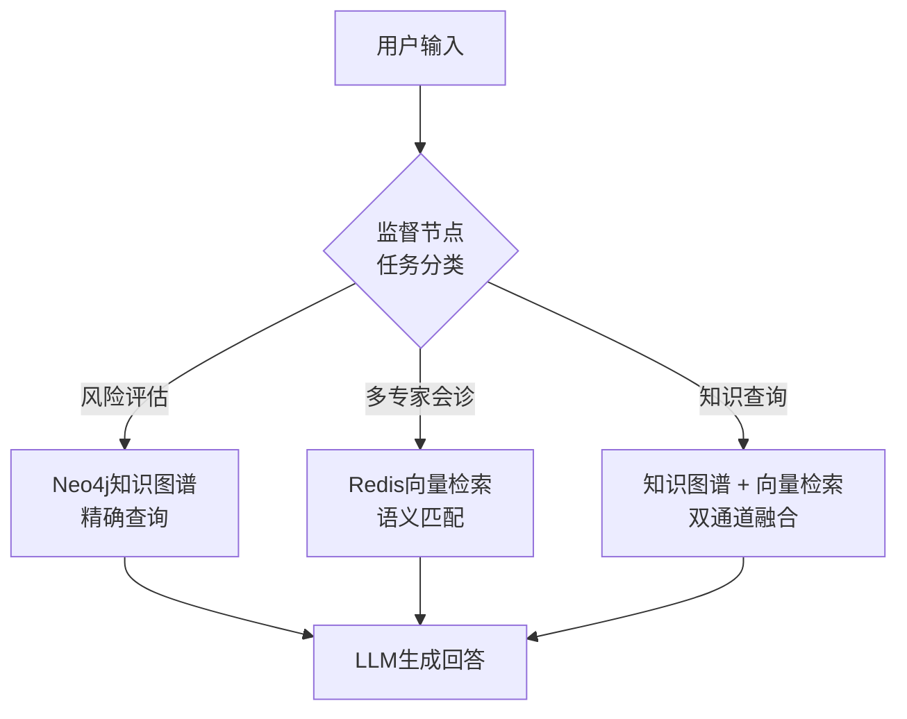
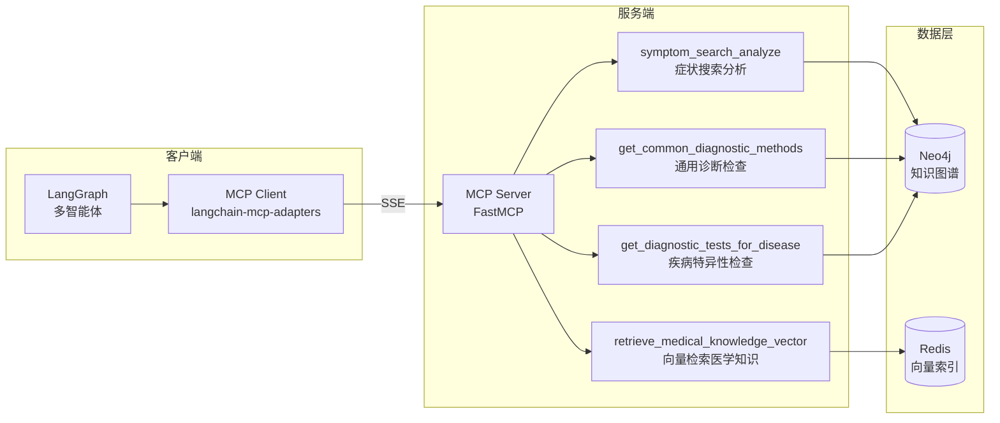

# 第二章 相关技术与理论基础 — 图表

> 所有图均与本系统直接相关，无通用技术示意图。

---

## 图 2-1 本系统 LLM 部署与调用架构

---

## 图 2-2 本系统提示工程应用示意

---

## 图 2-3 本系统多智能体主流程图

---

## 图 2-4 多专家会诊子流程图（agen_node 内部）

---

## 图 2-5 知识图谱示例（医学领域）

---

## 图 2-6 本系统 Neo4j 知识图谱数据模型

---

## 图 2-7 RAG 工作流程图

---

## 图 2-8 本系统混合检索策略

---

## 图 2-9 MCP 在本系统中的应用

