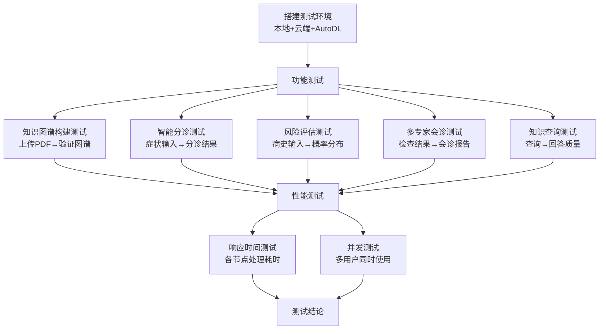
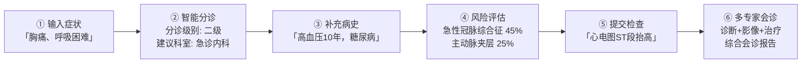
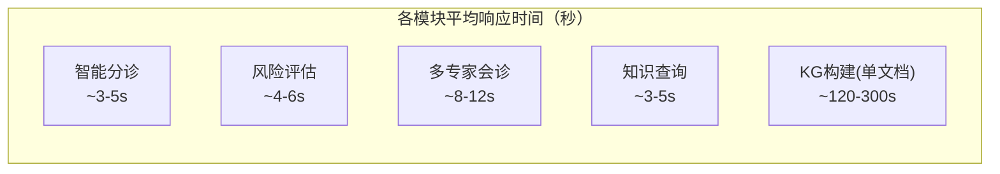

# 第五章 系统测试 — 图表

---

## 图 5-1 测试流程总览

```mermaid
graph TD
    ENV[搭建测试环境<br/>本地+云端+AutoDL] --> FUNC[功能测试]
    FUNC --> F1[知识图谱构建测试<br/>上传PDF→验证图谱]
    FUNC --> F2[智能分诊测试<br/>症状输入→分诊结果]
    FUNC --> F3[风险评估测试<br/>病史输入→概率分布]
    FUNC --> F4[多专家会诊测试<br/>检查结果→会诊报告]
    FUNC --> F5[知识查询测试<br/>查询→回答质量]
    F1 & F2 & F3 & F4 & F5 --> PERF[性能测试]
    PERF --> P1[响应时间测试<br/>各节点处理耗时]
    PERF --> P2[并发测试<br/>多用户同时使用]
    P1 & P2 --> RESULT[测试结论]
```

---

## 图 5-2 一次完整诊断流程测试路径

```mermaid
graph LR
    S1["① 输入症状<br/>「胸痛、呼吸困难」"] --> S2["② 智能分诊<br/>分诊级别: 二级<br/>建议科室: 急诊内科"]
    S2 --> S3["③ 补充病史<br/>「高血压10年，糖尿病」"]
    S3 --> S4["④ 风险评估<br/>急性冠脉综合征 45%<br/>主动脉夹层 25%"]
    S4 --> S5["⑤ 提交检查<br/>「心电图ST段抬高」"]
    S5 --> S6["⑥ 多专家会诊<br/>诊断+影像+治疗<br/>综合会诊报告"]
```

---

## 图 5-3 各功能模块响应时间对比（柱状图参考数据）

> 以下为柱状图数据参考，实际需在测试后用 Excel/ECharts 绘制。

```mermaid
graph LR
    subgraph 响应时间参考["各模块平均响应时间（秒）"]
        T1["智能分诊<br/>~3-5s"]
        T2["风险评估<br/>~4-6s"]
        T3["多专家会诊<br/>~8-12s"]
        T4["知识查询<br/>~3-5s"]
        T5["KG构建(单文档)<br/>~120-300s"]
    end
```

> ⚠️ 以上为预估值，需实际测试后更新。截图类图表（测试结果界面）需系统运行时截取。
