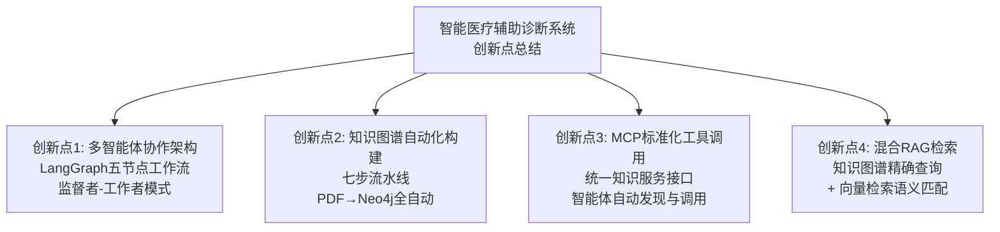
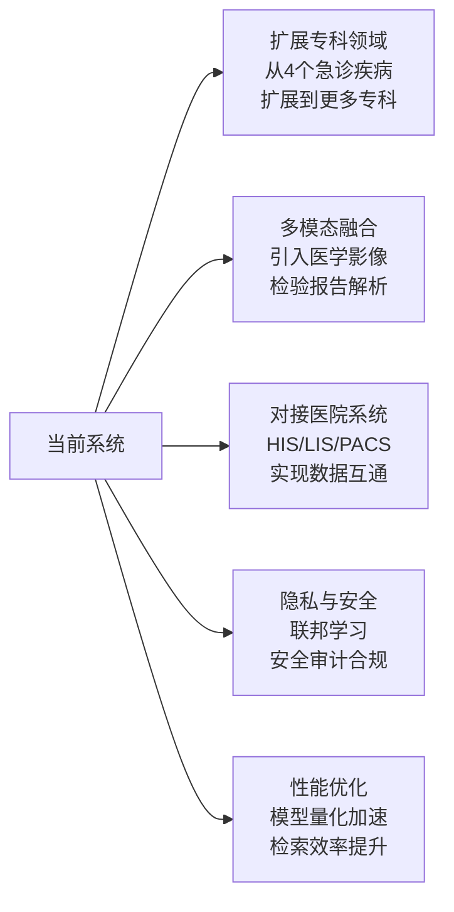

# 第六章 总结与展望 — 图表

---

## 图 6-1 系统创新点总结

```mermaid
graph TD
    SYS[智能医疗辅助诊断系统<br/>创新点总结]
    SYS --> I1["创新点1: 多智能体协作架构<br/>LangGraph五节点工作流<br/>监督者-工作者模式"]
    SYS --> I2["创新点2: 知识图谱自动化构建<br/>七步流水线<br/>PDF→Neo4j全自动"]
    SYS --> I3["创新点3: MCP标准化工具调用<br/>统一知识服务接口<br/>智能体自动发现与调用"]
    SYS --> I4["创新点4: 混合RAG检索<br/>知识图谱精确查询<br/>+ 向量检索语义匹配"]
```

---

## 图 6-2 未来展望方向

```mermaid
graph LR
    NOW[当前系统] --> F1[扩展专科领域<br/>从4个急诊疾病<br/>扩展到更多专科]
    NOW --> F2[多模态融合<br/>引入医学影像<br/>检验报告解析]
    NOW --> F3[对接医院系统<br/>HIS/LIS/PACS<br/>实现数据互通]
    NOW --> F4[隐私与安全<br/>联邦学习<br/>安全审计合规]
    NOW --> F5[性能优化<br/>模型量化加速<br/>检索效率提升]
```
