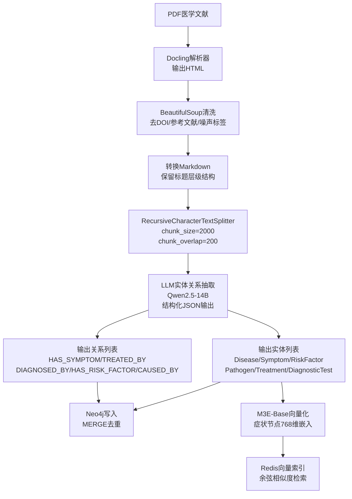
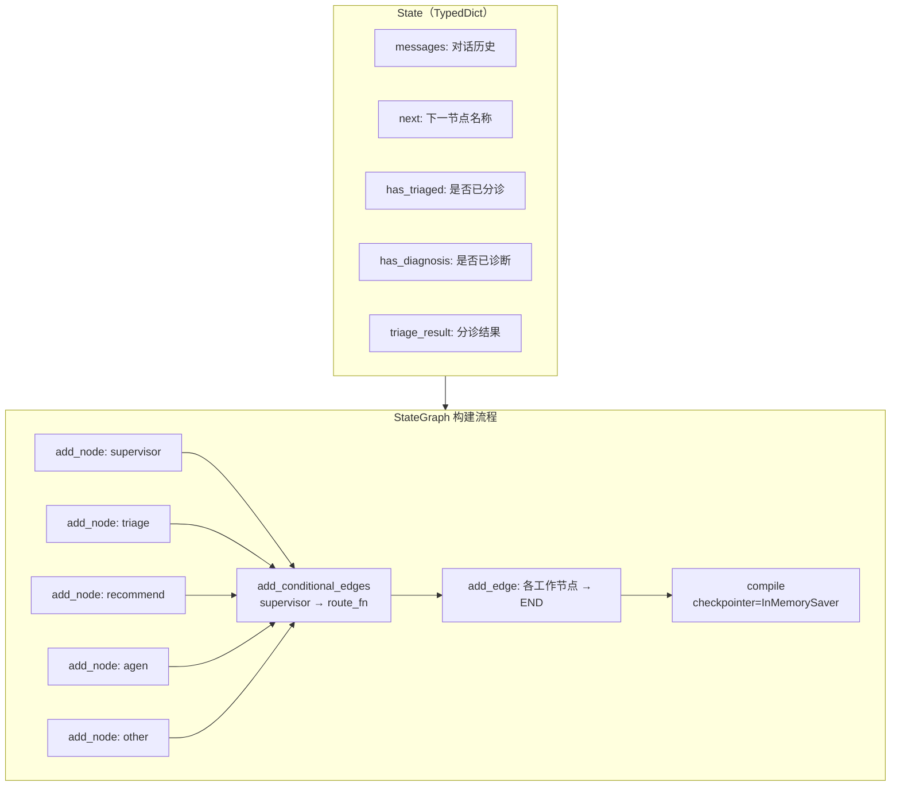
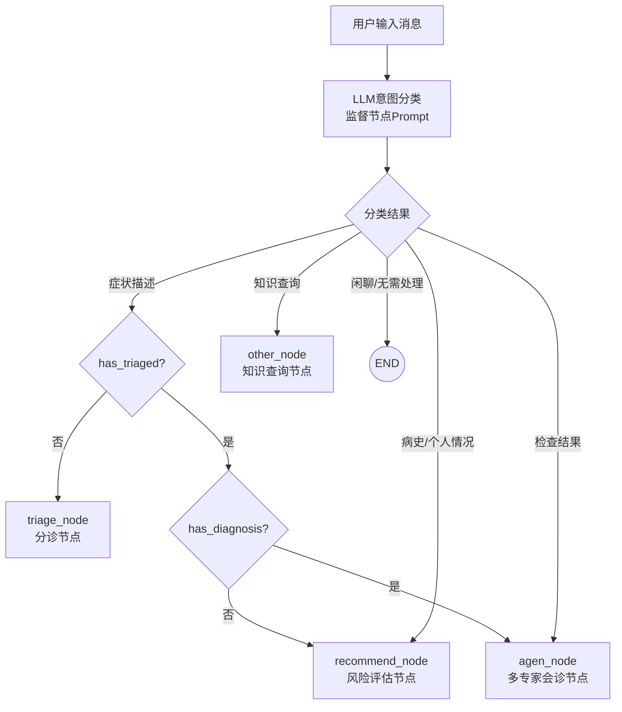
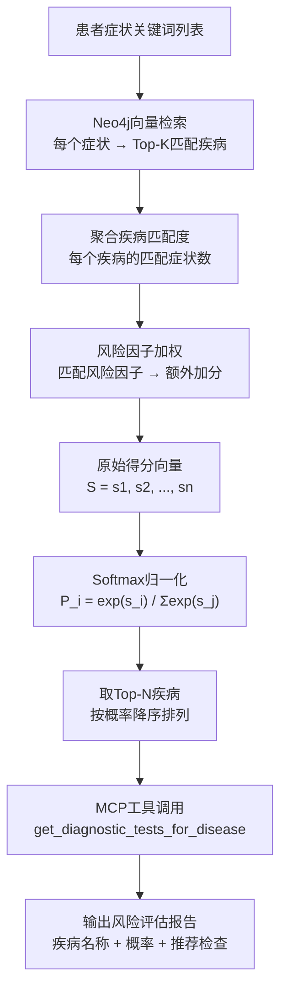
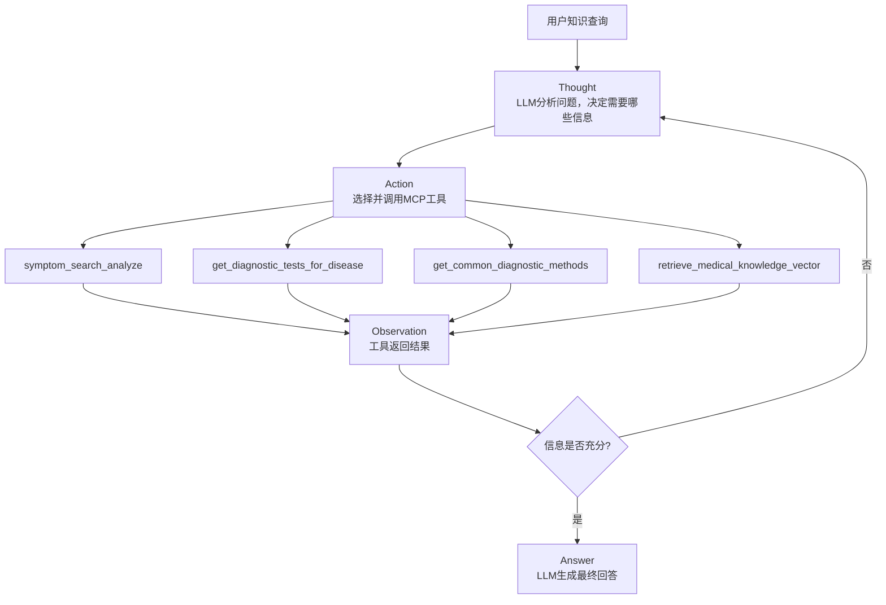
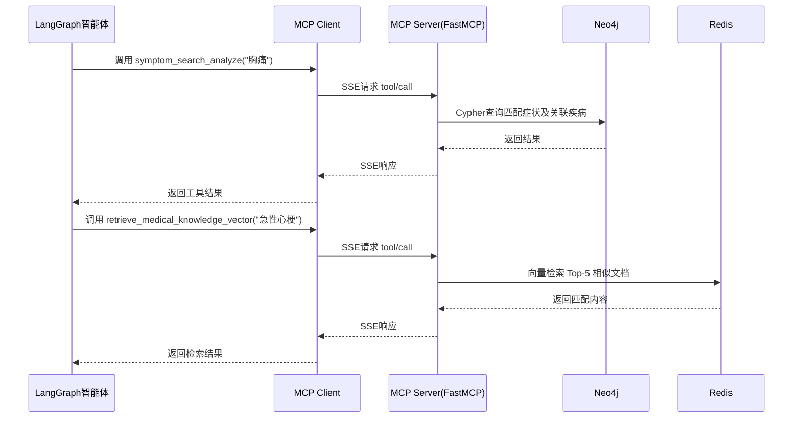
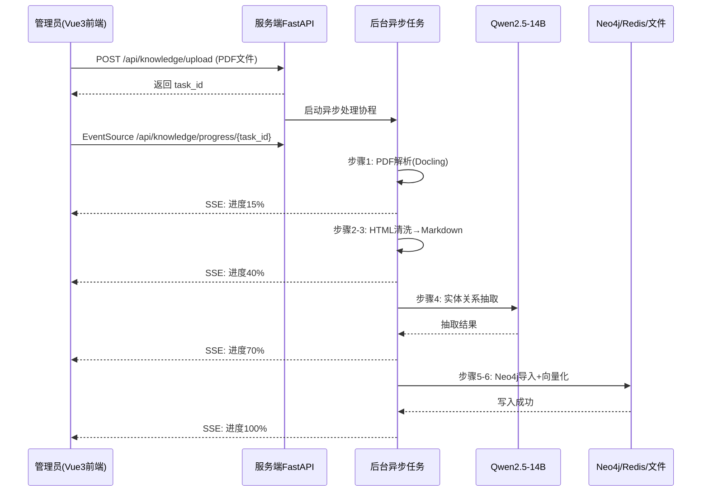
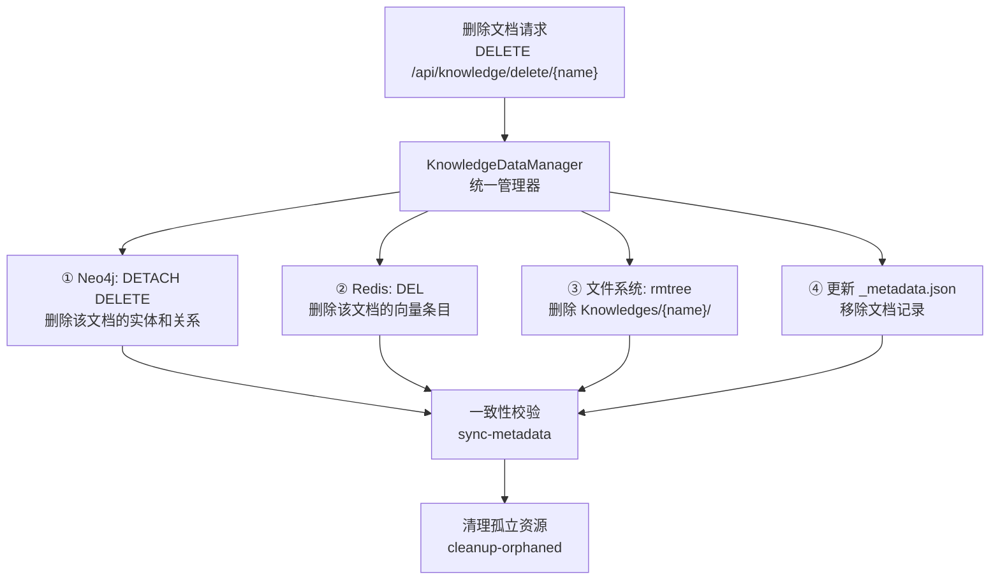
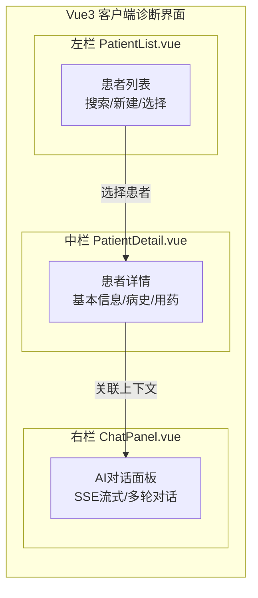
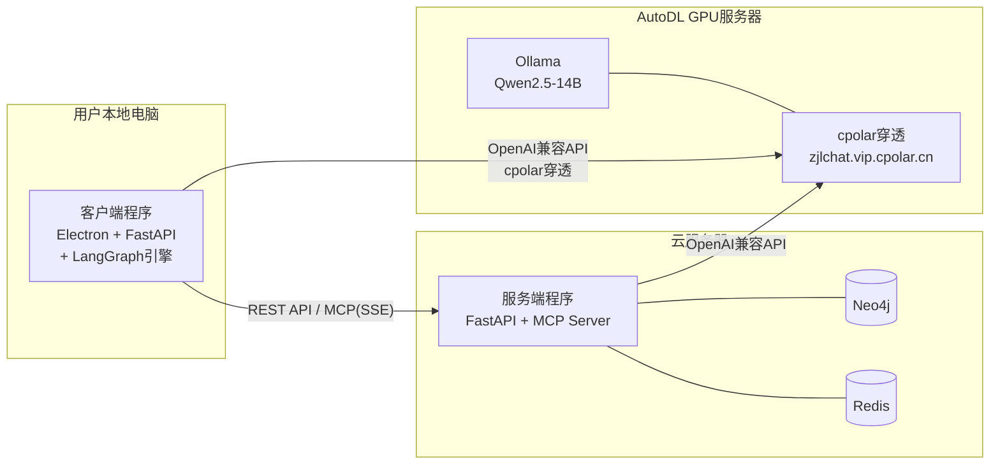

# 第四章 系统详细设计与实现 — 图表

---

## 图 4-1 知识图谱构建详细流程（含数据流）

---

## 图 4-2 LangGraph 状态图构建过程

---

## 图 4-3 监督节点路由决策逻辑

---

## 图 4-4 风险评估 Softmax 概率计算流程

---

## 图 4-5 ReAct 知识查询推理循环

---

## 图 4-6 MCP 工具调用时序图

---

## 图 4-7 PDF 上传异步处理与 SSE 进度推送

---

## 图 4-8 服务端数据一致性管理

---

## 图 4-9 客户端三栏界面布局

---

## 图 4-10 系统部署架构图

